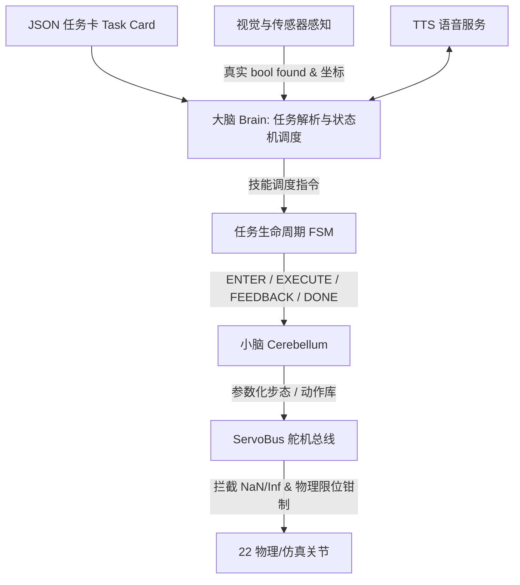

# A.T.R.I. (Autonomous Tabletop Robotic Intelligence)

> **全称**：AUTONOMOUS TABLETOP ROBOTIC INTELLIGENCE（桌面自主人形智能）  
> **一句话定位**：一台能自己看、自己想、自己走的桌面双足机器人。  
> **项目团队**：何浩睿 · 周柏宇 · 胡晟瑞 · 王旭琪 · 张景昆；**指导教师**：陈妍 · 李璐

[](software/atri/)
[](design/atri.urdf)
[](software/atri/run_demo.py)
[](software/atri/tests/)
[](#开源声明与许可证-notice--license)

```
22 DOF (双腿 10 · 双臂 8 · 躯干 2 · 头部 2)  ·  418 × 223 × 129 mm  ·  344 主包测试 + 40 仿真测试全绿  ·  5/5 赛题闭环  ·  Python 3.14
```

A.T.R.I. 面向中国国际大学生创新大赛（人形机器人专项·小人形组）及高校具身智能实验教学场景，直面阻碍双足进课堂与赛场的三大痛点：
1. **设备贵**：动辄数千至万元级套件难以成班普及。本方案全机统一采用 22 只总线舵机，将新增采购预算压至 **2725–3260 元**（全口径 3350–3950 元，扣除实验室已有边缘板与调试件）。
2. **算法散**：碎片化脚本缺乏统一骨架。本方案底座抽离出统一 FSM 调度器与 Skill 契约规范，换场景仅需换一张结构化 JSON 任务卡。
3. **断网瘫**：重度依赖云端大模型导致赛事网络抖动即死锁。本方案单目轻量视觉、离线 TTS 引擎与状态机全板载，实现**全离线 0 次网络出站闭环**。

方案完整闭环赛题规约的五项任务：
- **人脸检测迎宾**（T-01）：OpenCV Haar 级联检测截取人脸边界框并点头播报；**仅做边界框定位检测，未做高阶身份特征比对，不宣称「认出是谁」**；
- **二维码指令响应**（T-02）：解算二维码载荷中的标准 JSON 业务指令并状态转移；
- **目标物品搬运**（T-03）：夹爪开合与步数换算已接入任务卡；目标检测与对齐闭环尚未做，感知失败则停、不下发搬运；
- **自主足球踢球**（T-04）：单目测距定位球体，行进至击球区并执行参数化侧踢；
- **编排动作舞蹈**（T-05）：多姿态关键帧库回放，配合离线语音节拍完成展示。


---

## 快速上手 (Quick Start)

核心控制软件位于 `software/atri/`，仅依赖 **Python 3.14 标准库**（零 pip 依赖）。在无硬件连线、无 GPU 环境下，可直接跑通任务卡、技能状态机（FSM）到虚拟舵机总线的完整闭环：

```bash
# 1. 进入软件核心目录
cd software/atri

# 2. 运行主软件栈单元测试（344 项全部通过）
python3 -m unittest discover -s tests

# 3. 运行赛题五项任务无硬件闭环演练（--fast 跳过动作等待，秒级自检）
python3 run_demo.py --fast

# 4. 运行 Webots 控制器及映射离线自检（切回仓库根目录，40 项全部通过）
cd ../..
python3 -m unittest discover -s webots/tests
```

---

## 与 origin/main 的区别对照

本分支（`audit-fixes`）是在 `origin/main`（分叉点约 `c5491d9`）基础上完成的工程严密性重构与真实指标对齐。两分支的核心差异对照如下：

| 维度 / 项目 | origin/main 基线状态 | audit-fixes 本分支状态 | 工程依据与订正说明 |
|---|---|---|---|
| **代码与文档路径** | 混用中文路径：`软件/atri`、`项目文档/`、`研发日志/`、`材料汇总/` | 规范英文与分类路径：`software/atri`、`docs/{process,research,contest}` | 根除跨平台 CI、编码与构建工具链的路径编码隐患 |
| **Python 版本要求** | `Python 3.9+` | **仅限 Python 3.14 (`Python 3.14 only`)** | 消除版本假定模糊；CI 矩阵与全套标准库测试只对齐 3.14 严苛环境 |
| **测试套件规模** | 约 168 项主包测试 | **344 项主包测试 + 40 项 Webots 测试**（全绿） | 补齐 FSM 熔断、边界安全、数值截断与映射覆盖等大量防御性测试 |
| **语音引擎 (TTS)** | 仅支持 Mock 与 macOS `say` 命令 | **Linux 探测链**：`piper` → `espeak-ng` → `espeak` → `spd-say` + `ATRI_TTS` 环境变量 + 自动降级 Mock | 为 Linux aarch64 边缘板提供全套离线语音能力，支持指定引擎 |
| **技能与感知契约** | 感知失败仍返回 `ok` 假成功；`found` 可为字符串；超时乱 `home()` | **严格真成败判定**；`found` 必须为原生 `bool`；引入 `abort_event` 协作式超时，主线程退出后仅归零一次 | 根除把 `"False"` 字符串当真值、未检测到目标盲目挥臂的伪闭环缺陷 |
| **Webots 仿真判据** | 离线测试仅要求控制器可导入、节点可绑定（绑定即过） | **三层刚性判据**：22 关节全映射覆盖 + 非空节点绑定完整性 + **至少 1 个关节角位移 > 1°** | 40 项测试彻底杜绝空绑定或舵机静止也能通过的“假绿灯” |
| **动力学扭矩主判据** | 曾使用 1.47 N·m（堵转 50% 峰值）充当设计达标口径 | **严格以 0.98 N·m 连续额定为主判据**（踝关节超载达 167%，腰关节超载达 214%） | 严禁用瞬态峰值掩盖发热与连续过载；明确后续减重与大扭矩优化必要性 |
| **整机质量数据口径** | 容易混为单一质量数值，不同文档互相冲突 | **严格区分两层口径**：<br>① URDF/提交口径：结构 1790 g，整机 **3437 g**；<br>② CAD 实装口径：结构 1404 g，整机 **3050 g**（错轴后估计约 1490 g） | 杜绝计算阶段与制造阶段混淆；明确 CAD 掏空与错轴增重（+86 g）演进链条 |
| **电池容量与续航** | 未清晰交代续航限制与赛题差距 | **写清真实续航边界**：现选 2000 mAh 续航约 **13 分钟**；满足 30 分钟赛题要求标称容量必须 **≥ 4.53 Ah** | 诚实指出需扩容电池仓或外供电，杜绝虚报 30 分钟连续作业能力 |
| **机械错轴量定义** | 曾将 8–12 mm 端面间距混同为错轴量 | **严格定义错轴量为 30–35 mm**；严禁将 8–12 mm 净距称作错轴 | 沿自身轴向外抽出 30–35 mm，彻底解决 19.6 mm 间距下两只 35 mm 舵机机体干涉 |
| **答辩 PPT 交付物** | 包含 51 页 PPT 代码化生成脚本与过期输出文件 | **仅入库 `ppt/ATRI-答辩PPT-v4.pptx` 成品文稿（24 页）**，生成脚本移出版本库 | 杜绝历史废弃大体积脚本污染主库；严格对应大赛答辩现场规格 |
| **边缘算力板卡定位** | 文档易误解为强绑定树莓派 4B | **树莓派 4B 仅作为 BOM 成本与算力参考物**，软件完全按通用 Linux aarch64 编写 | 解耦硬件采购与软件运行环境，方便迁移至其他 aarch64 边缘计算平台 |
| **CAD 演进关系说明** | 历史记录一度给人 main 独占 CAD 改型的错觉 | **main 分叉后 CAD 成果已完整并入本分支**（含 `kind` 稳定定位、错轴件、`fitcheck.py` 等） | 本分支完全继承最新机械装配与干涉检查成果，并统一维护 |

---

## 这是什么 / 不是什么

- **全离线确定性控制栈**：采用“大脑—小脑”双层架构。大脑解析 JSON 任务卡并由有限状态机（FSM）调度；小脑负责参数化步态与动作库回放。感知成败与运动熔断严格绑定。
- **主包零第三方顶层依赖**：核心调度、运动学接口、状态机与单元测试仅依赖 Python 3.14 标准库。仅在接入实体摄像头时可选装 `opencv-python-headless`，生成二维码图像时可选装 `qrcode`。
- **已弃用端到端大模型（无 VLA）**：动作均由几何步态发生器与标定动作库生成，不做不可控的端到端生成式输出。
- **视觉只做轻量几何与检测，不做深度识别**：人脸模块使用 OpenCV Haar 级联检测器截取人脸边界框，**未做高阶人脸特征比对（不能识别人是谁）**；语音交互为离线文本发音（TTS），**不包含声纹识别**；二维码采用标准几何解算。
- **软件与仿真先导，样机未整机组装**：当前处于“设计冻结 + 仿真与脱机软件全绿”状态。实体 STS3215 舵机与骨架零件处于测试备料阶段，尚未开展整机物理在环联调。

---

## 仓库地图

```
ATRI/
├── software/atri/                  # 核心控制软件栈（Python 3.14，主包零第三方依赖）
│   ├── atri/                       # 控制包：config, brain, cerebellum, fsm, task_card 等
│   ├── task_cards/                 # 五项赛题结构化任务卡 JSON（T-01 ~ T-05）
│   ├── action_library/             # 预标定关键帧动作库（walk, kick, dance, carry 等）
│   ├── tests/                      # 主软件栈 344 项单元测试
│   └── run_demo.py                 # 五项任务无硬件快速演练入口
├── webots/                         # 仿真工程（22 DOF 仿真世界、控制器及测试）
│   ├── controllers/atri_controller # 机器人仿真控制器及软硬件关节映射
│   ├── worlds/atri_22dof.wbt       # 22 自由度自包含 Webots 仿真世界
│   └── tests/                      # 40 项关节映射完整率、覆盖度与实际角位移测试
├── design/                         # 机构与运动学模型
│   ├── atri.urdf                   # 22 自由度运动学与动力学描述
│   ├── cad/                        # CadQuery 参数化装配源码（独立 Python 3.9.6 环境）
│   ├── drawings/                   # 关节编号图、三视图、尺寸链图、舵机布局图
│   └── handoff/                    # STS3215 规格书核验、错轴分析、技术参数交接表
├── docs/                           # 工程过程记录、立项调研与参赛材料
│   ├── process/工程说明.md          # 仓库演进说明
│   ├── contest/                    # 省赛操作手册与申报附件
│   └── research/项目文档/           # 项目综述、技术方案、BOM 与可行性核查
├── ppt/                            # 答辩交付物
│   └── ATRI-答辩PPT-v4.pptx        # 24 页答辩演示文稿
└── NOTICE                          # 第三方参考资产（如 SO-ARM100 模型）合规声明
```

---

## 软件架构

软件系统采用双层解耦与防御性调度设计：



1. **大脑（Cognition & FSM）**：解析标准化 JSON 任务卡，驱动 FSM 生命周期。遵循真实成败契约：感知未找到目标（严格原生布尔 `found` 判定）时立即熔断退出，杜绝虚报成功。
2. **小脑（Motion & Safety）**：管理 22 自由度拓扑，生成参数化步态或回放关键帧动作。
3. **总线防御（Bus Safety）**：在 `ServoBus.set_angle` 统一拦截 `NaN` 与 `Inf` 异常浮点，执行物理角度限位钳制，防止舵机越界损坏。

详细模块设计与 API 参见 [software/atri/README.md](software/atri/README.md)。

---

## 设计口径与关键参数

项目中严禁混淆计算阶段与装配阶段的数据，核心量化指标统一规范如下：

| 维度 | 第一层：运动学与 URDF 口径 | 第二层：CAD 现行装配口径 | 说明与工程依据 |
|---|---|---|---|
| **整机尺寸** | 418 × 223 × 129 mm | 418 × 223 × 129 mm | 符合比赛规则（≤ 600 × 300 × 300 mm） |
| **结构件质量** | 1790 g | 1404 g（错轴改型后约 1490 g） | URDF 采用早期几何实算法；CAD 进行了减重掏空，错轴新件增重约 86 g |
| **整机总质量** | 3437 g | 3050 g | 包含 22 只舵机（1210 g）、板卡及紧固件；两套数据未做反向混淆 |
| **踝关节扭矩需求** | 1.630 N·m | 1.490 N·m | 来自单腿站立支撑动力学计算；分别对应两套整机质量 |
| **扭矩判断基准** | **0.98 N·m（连续额定，主判据）** | 1.47 N·m（堵转 50% 峰值，仅供参考） | **必须统一以 0.98 N·m 连续额定为主判据**；超载需后续进一步优化减重 |
| **腰部扭矩需求** | 2.092 N·m（连续额定比 214%） | — | 俯仰与侧倾复合工况 |
| **电池与续航** | 现选 2000 mAh（可用 1.6 Ah） | 理论需求 **≥ 4.53 Ah**（标称容量） | 整机平均电流约 7.25 A，现选电池仅能运行约 13 分钟，不足 30 分钟赛题要求 |
| **错轴量 (Stagger)** | — | **30–35 mm** | 沿舵机输出轴向外平移抽出，解决 19.6 mm 间距下两只 35 mm 舵机机体干涉；8–12 mm 属端面净距，禁止用作错轴量 |
| **BOM 成本** | 新增采购档：**2725–3260 元** | 全口径核算：**3350–3950 元** | 新增档扣除了实验室已有的边缘计算板与 STM32 调试件 |

---

## 运行平台与环境支持

- **基准平台**：基准运行环境为 Linux aarch64 配合 Python 3.14。由于多数嵌入式发行版未自带 Python 3.14，板端推荐源码编译安装。
- **算力选型**：BOM 清单中的树莓派 4B（4GB）仅作为算力基准与成本测算参考物，控制软件面向标准 Linux 接口编写，不绑定树莓派专有生态。
- **语音引擎**：Linux 下依次探测 `piper`、`espeak-ng`、`espeak`、`spd-say`，也可通过环境变量 `ATRI_TTS` 指定引擎；未检测到外部命令时自动降级为安全的 `MockTTS`。
- **CAD 依赖隔离**：CAD 装配基于 CadQuery 2.5.2 与 OpenCASCADE，固定运行在专用的 Python 3.9.6 虚拟环境（`.venv-cad`），与主软件环境完全隔离。

---

## 当前工程状态

| 模块 | 已完成 (Done) | 进行中 / 待真机验证 (WIP) | 规划中未做 (Planned) |
|---|---|---|---|
| **控制软件** | • 5/5 项任务卡快速演练闭环<br>• 344 项单元测试通过<br>• FSM 熔断、NaN 拦截与协作式超时 | • 真实摄像头采集帧率与延迟调优<br>• Linux 本地离线 TTS 音色配置 | • STM32 底层固件接管小脑总线（当前统一由板载 Python 调度） |
| **仿真环境** | • 22 DOF 自包含 Webots 世界与控制器<br>• 40 项映射覆盖度、绑定完整率与实际角行程离线测试通过 | • 步态在环动力学平衡调优 | • CI 无头环境下的自动化 3D 物理交互评测（受限于 Linux CI 无头图形环境） |
| **机械结构** | • 22 DOF URDF 描述文件<br>• 髋肩 30–35 mm 错轴改型（解决对咬干涉）<br>• 基于 `kind` 稳定元件装配 | • 样机 3D 打印件加工与备件装配<br>• 错轴受力件打印强度测试 | • 整体铝合金骨架 CNC 批量加工 |
| **电气硬件** | • 关节动力学推导与选型验证<br>• BOM 成本核算与分级采购清单 | • 采购单只 STS3215 12V 舵机实测温升与持续工作力矩<br>• 4.53 Ah 电池仓结构扩容方案 | • 专用供电管理与电流监测集成板设计 |

---

## 历史改动与工程演进记录

为保留工程演进脉络并供评审复核，本节归纳了审计分支及 main 分叉后的关键变更：

### 1. 审计分支关键修复 (Audit Fixes)

- **纠正技能假成功**：修复感知失败仍盲目上报 ok 的漏洞。未检测到目标时立即熔断后续动作（`tests/test_skills.py`）。
- **严格布尔校验**：`found` 字段强制校验原生 `bool` 类型，拒绝 `"False"` 字符串等非布尔真值隐患（`tests/test_perception.py`）。
- **消除动作重复下发**：修正踢球与舞蹈技能中因状态重复调用导致的底层运动指令重复下发（`tests/test_brain.py`）。
- **协作式超时机制**：引入 `abort_event` 标志位，长轨迹在帧边界主动检查退出；归零动作 `home()` 仅在主线程退出后执行一次（`tests/test_timeout.py`）。
- **总线非数防御**：在 `ServoBus.set_angle` 严格拦截 `NaN` 与 `Inf`，防止非数被错误截断为物理极限造成堵转损坏（`tests/test_cerebellum.py`）。
- **仿真严密三层判据**：Webots 离线测试重构为 22 关节全覆盖、全绑定、真实行程 > 1°，杜绝未绑定也能绿灯的假阳性（`webots/tests/` 40 项通过）。
- **纠正数据口径**：废除以 1.47 N·m 峰值掩盖过载的口径，明确以 0.98 N·m 额定连续扭矩为主判据；标称电池需求更新为 ≥ 4.53 Ah。

### 2. main 分叉后机械改型 (CAD Evolution)

自分叉点 `c5491d9` 以来，机械几何主要解决元件干涉与装配一致性：
- **装配判据统一**：引入 `fitcheck.py` 统一样机干涉判断逻辑，由 `interference.py` 执行整机干涉扫描。
- **电子件定位规则修正**：修复多处板卡因名称字符串变动导致未对准安装孔的装配位移，改用底层固化的 `kind` 属性定位。
- **髋肩错轴空间改型**：针对 19.6 mm 间距下两只 35 mm 舵机机体硬干涉，设计沿轴向外抽出 30–35 mm 的错轴空间结构（`fit_stagger.py`），消除机体碰撞。
- **新增连接与固定结构**：新增金属舵盘外侧连接臂 `cluster_horn_arm`、副轴外抱架 `cluster_outrigger` 与后置板卡托架 `backpack_plate`。

---

## 开源声明与许可证 (Notice & License)

- **第三方参考模型**：涉及 SO-ARM100 的 10 份参考资产保留上游一致性，遵循 Apache 2.0 许可证，详见根目录 `NOTICE` 及相关目录下的协议文件。
- **选型规格资料**：舵机厂商规格说明 PDF 仅作为内部硬件接口核验使用，不作商业二次发行。
- **主项目许可证**：本仓库整体开源许可证处于评审待定阶段（LICENSE 待定）。
