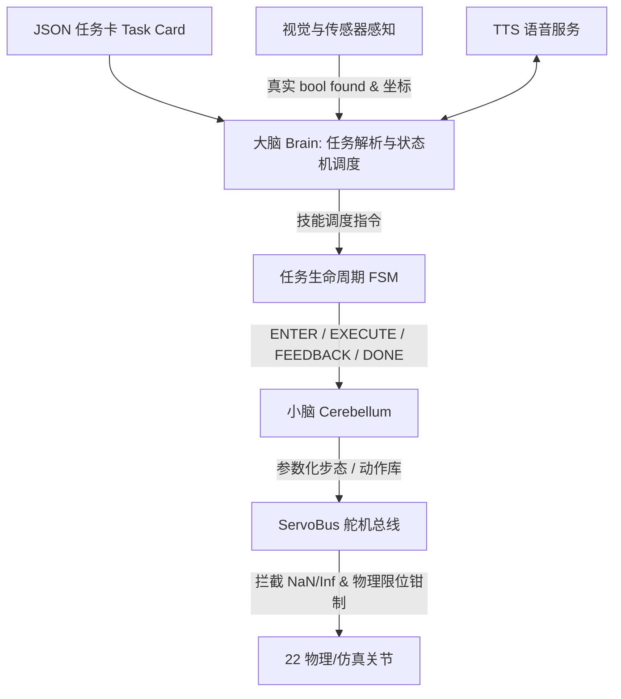

# A.T.R.I. (Autonomous Tabletop Robotic Intelligence)

> **全称**：AUTONOMOUS TABLETOP ROBOTIC INTELLIGENCE（桌面自主人形智能）  
> **一句话定位**：一台能自己看、自己想、自己走的桌面双足机器人。  
> **项目团队**：何浩睿 · 周柏宇 · 胡晟瑞 · 王旭琪 · 张景昆；**指导教师**：陈妍 · 李璐

[](software/atri/)
[](design/atri.urdf)
[](software/atri/run_demo.py)
[](software/atri/tests/)
[](#开源声明与许可证-notice--license)

```
22 DOF (双腿 10 · 双臂 8 · 躯干 2 · 头部 2)  ·  CAD 实装 407 × 263 × 146 mm  ·  427 主包测试 + 40 仿真测试  ·  5/5 赛题闭环  ·  Python 3.14
```

A.T.R.I. 面向中国国际大学生创新大赛（人形机器人专项·小人形组）及高校具身智能实验教学场景，直面阻碍双足进课堂与赛场的三大痛点：
1. **设备贵**：动辄数千至万元级套件难以成班普及。本方案全机统一采用 22 只总线舵机，将新增采购预算压至 **2725–3260 元**（全口径 3350–3950 元，扣除实验室已有边缘板与调试件）。
2. **算法散**：碎片化脚本缺乏统一骨架。本方案底座抽离出统一 FSM 调度器与 Skill 契约规范，换场景仅需换一张结构化 JSON 任务卡。
3. **断网瘫**：重度依赖云端大模型导致赛事网络抖动即死锁。本方案单目轻量视觉、离线 TTS 引擎与状态机全板载，实现**全离线 0 次网络出站闭环**。

方案完整闭环赛题规约的五项任务：
- **人脸检测迎宾**（T-01）：**人脸检测（Haar 框），不做身份比对**；OpenCV Haar 级联截取边界框并点头播报，不宣称「认出是谁」；
- **二维码指令响应**（T-02）：解算二维码载荷中的标准 JSON 业务指令并状态转移；
- **目标物品搬运**（T-03）：夹爪开合与步数换算已接入任务卡；目标检测与对齐闭环尚未做，感知失败则停、不下发搬运；
- **自主足球踢球**（T-04）：单目测距定位球体，行进至击球区并执行参数化侧踢；
- **编排动作舞蹈**（T-05）：多姿态关键帧库回放，配合离线语音节拍完成展示。


---

## 快速上手 (Quick Start)

核心控制软件位于 `software/atri/`，仅依赖 **Python 3.14 标准库**（零 pip 依赖）。在无硬件连线、无 GPU 环境下，可直接跑通任务卡、技能状态机（FSM）到虚拟舵机总线的完整闭环：

```bash
# 1. 进入软件核心目录
cd software/atri

# 2. 运行主软件栈单元测试（427 项）
python3 -m unittest discover -s tests

# 3. 运行赛题五项任务无硬件闭环演练（--fast 跳过动作等待，秒级自检）
python3 run_demo.py --fast

# 4. 运行 Webots 控制器及映射离线自检（切回仓库根目录，40 项全部通过）
cd ../..
python3 -m unittest discover -s webots/tests
```

---

## 本分支定位（atri-next，不合 main）

本分支是软件先进线，**不向 main 合入，也不从 main 拉取**。2026-09-12 第 7 轮在本分支改了 CAD 布置（U 形骨盆接到胸框 / 左右脚镜像 / 拾音并进相机罩），口径以本树 `design/cad` 为准。

对照对象：`origin/main` @ `60d8611`（分叉时的口径快照）。历史上已把该提交及之前的 CAD / 真机总线并进来过一次；**之后不再从 main 拉、也不向 main 合**。旧名 `audit-fixes` 已删，远程只留 `main` 与 `atri-next`。

数字以 `design/robot_model.json` 与 `software/atri/config/robot.json` 为准。包络顺序一律 **高 × 宽 × 深**（与 `size_cm = [14.6, 26.3, 40.7]` 的深×宽×高不同）。

| 维度 | origin/main @ 60d8611 | 本分支 atri-next | 说明 |
|---|---|---|---|
| **路径** | `软件/atri`、`项目文档/`、`研发日志/` | `software/atri`、`docs/{process,research,contest}` | 合入时把 main 新增的 `bus_sts3215.py` / `bringup.py` / 测试迁到英文路径 |
| **Python / CI** | 3.9 / 3.11 / 3.12；最新两次 CI **红**（`.wbt` 质量未随 `robot_model.json` 重生成） | **仅 Python 3.14**；世界文件按本分支生成器重刷（保留 minStop/maxStop） | main 的红灯是 23 条 `Physics { mass }` 过期，不是关节拓扑错 |
| **机械口径** | CAD 实装 **407 × 263 × 146 mm**；结构 **1490 g / 81 件（实算）**；整机 **3136 g（纸面推算，未定案）** | **407 × 263 × 147 mm**（第 7 轮，宽未涨） | 赛框 600×300×300；宽门禁 270。旧文案 418×223×129 是历史虚高 |
| **扭矩主判据** | 官方额定 **0.98 N·m**；踝 1.492 N·m（152%）；`trunk_roll` 1.899 N·m（194%） | 同左 | 1.47 N·m（堵转×50%）只作峰值参考 |
| **功率 / 电池** | 平均约 **18.92 A**；30 min 需标称 **11.83 Ah / 1.19 kg**；现选 2000 mAh 约 13 min | 同左；测试要求超标必须留下 `model_caveat` | 旧「≥4.53 Ah」是误用堵转当额定时的低估 |
| **真机总线** | `bus_sts3215.py` + 假串口测试；中位默认写寄存器 **31** | 已在本线；`deg_to_pulse` / `Sts3215Bus` 拒绝 NaN/Inf，禁止满脉冲下发 | 飞特官方 SDK 一键置中是 **40 号写 128**（固件再写入 31）。未上真机前两条通路都保留 |
| **CAD 工具** | `pair_inspect.py` / `sweep_check.py` / `tool_access.py` / `reference_fits.py` | 第 6 轮布置：U 形骨盆、头壳让位、肘叉紧凑、足后跟 48 mm；门禁 `design/cad/test_layout.py` | 剩余 ❌ 见 `design/handoff/装配一致性修正记录.md` 第 6 轮；禁止把 pair_inspect 切盒贴进零件 |
| **技能 / Webots 契约** | 感知失败仍可能假成功；世界文件无硬限位 | **真成败**；`found` 必须是 `bool`；行程 >1° 才算过；世界带 minStop/maxStop | 这是 atri-next 相对 main **多出来的**软件纪律 |
| **TTS / PPT / NOTICE** | macOS `say` + Mock；过程文档散落中文目录；无 NOTICE | Linux 离线 TTS 链；24 页 `ppt/ATRI-答辩PPT-v4.pptx`；根目录 `NOTICE` | 主项目 LICENSE **仍待定**：NOTICE 只覆盖 SO-ARM100 Apache-2.0 参考件，不构成对 ATRI 原创代码的授权 |
| **测试规模** | 主包测试 + STS3215 假串口 + bring-up | **427 主包 + 40 Webots**（本机实测全绿） | 以 `python3 -m unittest discover` 当场输出为准 |

---

## 这是什么 / 不是什么

- **全离线确定性控制栈**：采用“大脑—小脑”双层架构。大脑解析 JSON 任务卡并由有限状态机（FSM）调度；小脑负责参数化步态与动作库回放。感知成败与运动熔断严格绑定。
- **主包零第三方顶层依赖**：核心调度、运动学接口、状态机与单元测试仅依赖 Python 3.14 标准库。仅在接入实体摄像头时可选装 `opencv-python-headless`，生成二维码图像时可选装 `qrcode`。
- **已弃用端到端大模型（无 VLA）**：动作均由几何步态发生器与标定动作库生成，不做不可控的端到端生成式输出。
- **视觉只做轻量几何与检测，不做深度识别**：人脸模块使用 OpenCV Haar 级联检测器截取人脸边界框，**未做高阶人脸特征比对（不能识别人是谁）**；语音交互为离线文本发音（TTS），**不包含声纹识别**；二维码采用标准几何解算。
- **软件与仿真先导，样机未整机组装**：当前处于“设计冻结 + 仿真与脱机软件全绿”状态。实体 STS3215 舵机与骨架零件处于测试备料阶段，尚未开展整机物理在环联调。

---

## 仓库地图

```
ATRI/
├── software/atri/                  # 核心控制软件栈（Python 3.14，主包零第三方依赖）
│   ├── atri/                       # 控制包：config, brain, cerebellum, bus_sts3215, bringup 等
│   ├── task_cards/                 # 五项赛题结构化任务卡 JSON（T-01 ~ T-05）
│   ├── action_library/             # 预标定关键帧动作库（walk, kick, dance, carry 等）
│   ├── tests/                      # 主软件栈单元测试（含 STS3215 假串口与 bring-up）
│   └── run_demo.py                 # 五项任务无硬件快速演练入口
├── webots/                         # 仿真工程（22 DOF 仿真世界、控制器及测试）
│   ├── controllers/atri_controller # 机器人仿真控制器及软硬件关节映射
│   ├── worlds/atri_22dof.wbt       # 22 自由度自包含 Webots 仿真世界
│   └── tests/                      # 40 项关节映射完整率、覆盖度与实际角位移测试
├── design/                         # 机构与运动学模型
│   ├── atri.urdf                   # 22 自由度运动学与动力学描述
│   ├── cad/                        # CadQuery 参数化装配源码（独立 Python 3.9.6 环境）
│   ├── drawings/                   # 关节编号图、三视图、尺寸链图、舵机布局图
│   └── handoff/                    # STS3215 规格书核验、错轴分析、技术参数交接表
├── docs/                           # 工程过程记录、立项调研与参赛材料
│   ├── process/工程说明.md          # 仓库演进说明
│   ├── contest/                    # 省赛操作手册与申报附件
│   └── research/项目文档/           # 项目综述、技术方案、BOM 与可行性核查
├── 固件/                           # 接线与寄存器语义（不是已烧录固件）
├── ppt/                            # 答辩交付物
│   └── ATRI-答辩PPT-v4.pptx        # 24 页答辩演示文稿
└── NOTICE                          # 第三方参考资产（如 SO-ARM100 模型）合规声明
```

---

## 软件架构

软件系统采用双层解耦与防御性调度设计：



1. **大脑（Cognition & FSM）**：解析标准化 JSON 任务卡，驱动 FSM 生命周期。遵循真实成败契约：感知未找到目标（严格原生布尔 `found` 判定）时立即熔断退出，杜绝虚报成功。
2. **小脑（Motion & Safety）**：管理 22 自由度拓扑，生成参数化步态或回放关键帧动作。
3. **总线防御（Bus Safety）**：`clamp_angle` 与 `deg_to_pulse` 拒绝 `NaN` / `Inf`。Mock / Webots 走 `ServoBus.set_angle` 模板；真机 `Sts3215Bus` 覆盖 `set_angle`，换算仍走 `deg_to_pulse`，不能把非有限值变成满脉冲。

详细模块设计与 API 参见 [software/atri/README.md](software/atri/README.md)。

---

## 设计口径与关键参数

项目中严禁混淆计算阶段与装配阶段的数据，核心量化指标统一规范如下：

| 维度 | 第一层：运动学与 URDF 口径 | 第二层：CAD 现行装配口径 | 说明与工程依据 |
|---|---|---|---|
| **整机尺寸** | 运动学基元 372.8 × 190 × 123 mm | **CAD 实装 407 × 263 × 146 mm** | 报名用实装。赛题上限 600×300×300；宽余量只剩 37 mm（肩部外挂错轴的代价） |
| **结构件质量** | URDF 仍为历史 1790 g（待回灌） | **1490 g / 81 件（CAD 实算）** | 历史链 1790 → 1404 → 1490；URDF link 质量尚未改，避免和未定案的整机方案抢跑 |
| **整机总质量** | 历史提交口径 3437 g | **3136 g（纸面推算，重量方案未定案）** | 结构实算 + 舵机 1210 + 电子件与电池 316 + 线束紧固件 120 |
| **踝关节扭矩需求** | 随质量口径变 | **1.492 N·m（占 0.98 的 152%）** | 单腿支撑工况；减重路径 A/B/C 按 0.98 均未达标 |
| **扭矩判断基准** | **0.98 N·m（官方额定负载 10 kg·cm @12V，主判据）** | 1.47 N·m（堵转×50%，仅峰值参考） | 12V 变体推断值，待买 1 只 STS3215 实测温升 |
| **腰部扭矩需求** | — | **`trunk_roll` 1.899 N·m（194%）** | 上半身重力 + 惯性，比踝更紧 |
| **电池与续航** | 现选 2000 mAh（约 13 min） | 30 min 需标称 **11.83 Ah / 整包约 1.19 kg** | 额定订正后平均电流约 18.92 A。答辩不要写 30 分钟续航 |
| **错轴量 (Stagger)** | — | **30–35 mm** | 沿舵机输出轴向外平移抽出，解决 19.6 mm 间距下两只 35 mm 舵机机体干涉；8–12 mm 属端面净距，禁止用作错轴量 |
| **BOM 成本** | 新增采购档：**2725–3260 元** | 全口径核算：**3350–3950 元** | 新增档扣除了实验室已有的边缘计算板与 STM32 调试件 |

---

## 运行平台与环境支持

- **基准平台**：基准运行环境为 Linux aarch64 配合 Python 3.14。由于多数嵌入式发行版未自带 Python 3.14，板端推荐源码编译安装。
- **算力选型**：BOM 清单中的树莓派 4B（4GB）仅作为算力基准与成本测算参考物，控制软件面向标准 Linux 接口编写，不绑定树莓派专有生态。
- **语音引擎**：Linux 下依次探测 `piper`、`espeak-ng`、`espeak`、`spd-say`，也可通过环境变量 `ATRI_TTS` 指定引擎；未检测到外部命令时自动降级为安全的 `MockTTS`。
- **CAD 依赖隔离**：CAD 装配基于 CadQuery 2.5.2 与 OpenCASCADE，固定运行在专用的 Python 3.9.6 虚拟环境（`.venv-cad`），与主软件环境完全隔离。

---

## 当前工程状态

| 模块 | 已完成 (Done) | 进行中 / 待真机验证 (WIP) | 规划中未做 (Planned) |
|---|---|---|---|
| **控制软件** | • 5/5 项任务卡快速演练闭环<br>• 主包 + Webots 离线测试<br>• FSM 熔断、NaN 拦截与协作式超时<br>• STS3215 真机总线（假串口可单测） | • 真实摄像头采集帧率与延迟调优<br>• Linux 本地离线 TTS 音色配置<br>• 中位标定：默认写 31，官方一键置中是 40=128 | • STM32 固件接管小脑（`固件/README.md` 为接线与语义，不是已烧录固件） |
| **仿真环境** | • 22 DOF 自包含 Webots 世界与控制器<br>• 40 项映射覆盖度、绑定完整率与实际角行程离线测试通过 | • 步态在环动力学平衡调优 | • CI 无头环境下的自动化 3D 物理交互评测（受限于 Linux CI 无头图形环境） |
| **机械结构** | • 22 DOF URDF 描述文件<br>• 髋肩 30–35 mm 错轴改型（解决对咬干涉）<br>• 基于 `kind` 稳定元件装配 | • 样机 3D 打印件加工与备件装配<br>• 错轴受力件打印强度测试 | • 整体铝合金骨架 CNC 批量加工 |
| **电气硬件** | • 关节动力学推导与选型验证<br>• BOM 成本核算与分级采购清单<br>• 功率缺口已写入交接包（11.83 Ah） | • 采购单只 STS3215 12V 舵机实测温升与持续工作力矩<br>• 电池仓扩容或外供方案（现选 2000 mAh 不够 30 min） | • 专用供电管理与电流监测集成板设计 |

---

## 历史改动与工程演进记录

为保留工程演进脉络并供评审复核，本节归纳软件线相对 main 的关键变更。当前工作分支是 **`atri-next`**，不合 main。

### 1. 审计修复（原 `audit-fixes`，已并入 `atri-next`）

- **纠正技能假成功**：修复感知失败仍盲目上报 ok 的漏洞。未检测到目标时立即熔断后续动作（`software/atri/tests/test_brain.py`）。
- **严格布尔校验**：`found` 字段强制校验原生 `bool` 类型，拒绝 `"False"` 字符串等非布尔真值隐患（`tests/test_perception.py`）。
- **消除动作重复下发**：修正踢球与舞蹈技能中因状态重复调用导致的底层运动指令重复下发（`tests/test_brain.py`）。
- **协作式超时机制**：引入 `abort_event` 标志位，长轨迹在帧边界主动检查退出；归零动作 `home()` 仅在主线程退出后执行一次（`software/atri/tests/test_brain.py` 与 `test_fsm.py`）。
- **总线非数防御**：`clamp_angle` 拦截 `NaN` / `Inf`（`tests/test_cerebellum.py`）。真机路径另在 `deg_to_pulse` 拒绝非有限值，避免 `Sts3215Bus` 把 NaN 写成满脉冲（`tests/test_config.py`、`tests/test_bus_sts3215.py`）。
- **仿真严密三层判据**：Webots 离线测试重构为 22 关节全覆盖、全绑定、真实行程 > 1°，杜绝未绑定也能绿灯的假阳性（`webots/tests/` 40 项通过）。
- **纠正数据口径**：废除以 1.47 N·m 峰值掩盖过载的口径，明确以 0.98 N·m 额定连续扭矩为主判据。额定订正后 30 min 电池需求升到 **11.83 Ah**（不是 4.53 Ah）。

### 2. 已从 origin/main 合入的机械与真机改动 (CAD / Bus)

自分叉点 `c5491d9` 到 `60d8611`：
- **装配判据统一**：`fitcheck.py` + `interference.py`；第 5 轮后 `pair_inspect.py` 把干涉体变回零件坐标系。
- **电子件按 `kind` 落座**，不再靠名称字符串。
- **髋肩错轴 30–35 mm**：`cluster_horn_arm` + `cluster_outrigger` + `backpack_plate`。宽从 223 吃到 **263 mm**。
- **口径订正**：实装包络 **407 × 263 × 146 mm**；结构 **1490 g / 81 件**；整机 3136 g 纸面推算。
- **STS3215 真机总线** `software/atri/atri/bus_sts3215.py`（SYNC WRITE、遥测、假串口测试）+ `固件/README.md`。
- **功率测试**改为「缺口必须被记录」，不许用绿测掩盖 11.83 Ah 超标。

### 3. `atri-next` 收口（当前）

- 分支从 `audit-fixes` 改名为 **`atri-next`**；远程旧名已删，tag `audit-fixes-frozen` 指向改名前的 `13b9ab2`。
- 不对 `main` 开合入 PR（曾开的 #1 / #2 已关、未合）。CAD 由 main / CAD 会话维护，本线不再拉 main。
- 真机 `deg_to_pulse` / `Sts3215Bus.set_angle` 对 NaN/Inf 抛错且不发帧。
- T-01 文案改为「人脸检测迎宾」，不做身份比对。

---

## 开源声明与许可证 (Notice & License)

- **第三方参考模型**：涉及 SO-ARM100 的 10 份参考资产保留上游一致性，遵循 Apache 2.0 许可证，详见根目录 `NOTICE` 及相关目录下的协议文件。
- **选型规格资料**：舵机厂商规格说明 PDF 仅作为内部硬件接口核验使用，不作商业二次发行。
- **主项目许可证**：根目录 **没有 LICENSE**。这不是漏文件：NOTICE 明确不授权 ATRI 自己的代码与文档。第三方 SO-ARM100 资产按 Apache-2.0 保留；飞特规格 PDF 不作二次发行。原创部分在版权人书面同意之前，默认「未授权、保留所有权利」。不要把 NOTICE 读成整库 Apache/MIT。
