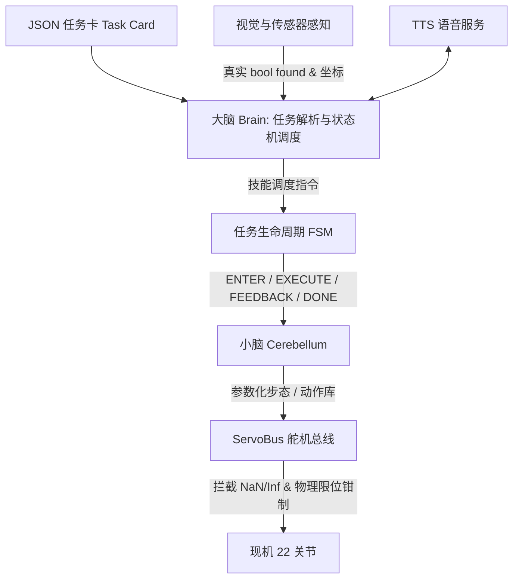

# A.T.R.I. (Autonomous Tabletop Robotic Intelligence)

> **ATRI-v2 A 路线（本分支）**：20 DOF 桌面人形重构。**20×Feetech STS3215-C018（12 V，额定 0.98 N·m）**，6061 铝夹层承力 + **2.4 mm PETG 不透明哑光白**外壳，开放骨盆框架，髋/腰双侧支承，**单舵机两指夹爪**（固定指 + 活动指 + 指垫 + 隔柱 + 支承），**单电池**，头部前侧 VL53L1X 预留。
>
> **现机 22 DOF 软件保持冻结，没有迁移到本机构。** 本分支的机构口径一切以 [`design/v2/`](design/v2/README.md) 为准；软件口径仍属现机，见文末[附录](#附录现机-22-dof-软件与旧-cad未迁移到本机构)。


> 上图：**CAD 路径追踪（Cycles HIP）审查渲染，不是实物照片**。本分支没有任何已制造整机。

[](design/v2/out/sim/atri_v2.urdf)
[](design/v2/out/ATRI-v2-BOM.md)
[](design/v2/MANUFACTURING-NOTES.md)
[](software/atri/README.md)
[](design/v2/out/gates.json)
[](design/v2/out/%E8%B4%A8%E9%87%8F%E8%B4%A6.md)
[](#开源声明与许可证-notice--license)

```
20 DOF v2 机构（头 2 · 躯干 2 · 腿 4+4 · 臂 4+4，无 hip_yaw）  ·  20×C018 12V  ·  零位 CAD 外包络 466.5 × 188 × 295 mm  ·  已计质量 ≈2469 g（超 2450 g 硬顶，未计齐）  ·  现机 22 DOF 软件冻结  ·  Python 3.14
```

---

## 本分支是什么 / 不是什么

**是：**

- **A 路线（铝 + PETG）实装审查设计。** 承力件为 6061 铝夹层（激光平板 + 标准角铝/铝管 + 局部转接），外壳为 2.4 mm 不透明哑光白 PETG/TPU。
- **20 DOF、无 hip_yaw 的新机构。** 骨盆改为开放框架、局部角铝转接与外部壳体夹持；髋侧摆与腰侧摆均改为**前后双侧支承**（后角铝 + 自由后盘 + 轴端保持件）。骨盆输出转接件已重画以避开中框碰撞。
- **单舵机两指夹爪。** 每只手一只 C018，固定指 + 活动指 + 指垫 + 隔柱 + 支承；没有双手舵机方案。
- **单电池方案。** 仅一只 Gens Ace GEA223S25T3GT（3S 2200 mAh）按实际包络进入主装配；第二包与扩展托盘已移除。想加第二包是**受门禁的提案**，不在主装配里，见 [`POWER-EXPANSION.md`](design/v2/POWER-EXPANSION.md)。
- **传感器预留。** VL53L1X 作为头部前侧 20×24×1.6 mm 夹扣/胶粘预留包络进入主装配，**未虚构厂商安装孔**。

**不是：**

- **不是已打样整机。** CAD 审查、加工文件、光追图同源输出，但**没有已制造实物**。CAD 审查 ≠ 打样 ≠ 赛题验证。
- **不是制造放行版。** `design_mass_closed: false`、`physical_mass_verified: false`，G0–G4 全部开放。
- **不是 22 DOF 真机闭环。** 仓库里的 5/5 Mock 任务演练属于**现机 22 DOF 软件**，**不能当作 v2 硬件的赛事通过证据**。

---

## 当前状态与门禁

| 维度 | 现状 | 说明 |
|---|---|---|
| **阶段** | CAD 审查（design-provisional） | 同源 STEP/STL/3MF/DXF/URDF/WebGL，见[可下载产物](#可下载与审查产物) |
| **零件数** | 装配快照当前 **1033** 件 | `assembly-snapshot.json` 仍含待清理的 `battery-secondary*` 三项；同源导出清理后约 **1030** 件。**这不是放行数字。** |
| **质量账** | 已计 **≈2469 g**，设计目标 2300 g，硬顶 2450 g | **超硬顶**；未计线束、相机、总线板、降压板、IMU、音频等，**不得填 0**。见 [`质量账.md`](design/v2/out/%E8%B4%A8%E9%87%8F%E8%B4%A6.md) |
| **门禁 G0–G4** | **全部 OPEN** | G0 购物车、G1 温升、G2 单腿质量、G3 赛方定义、G4 无 hip_yaw 转向误差。见 [`gates.json`](design/v2/out/gates.json) |
| **软件对齐** | T1/T3 条件对齐；**T2/T4/T5 未对齐** | 现机 22 DOF 软件未迁移；T4 踢球代码仍在写 `hip_yaw`。见 [`T1-T5-HARDWARE-ALIGNMENT.md`](design/v2/T1-T5-HARDWARE-ALIGNMENT.md) |
| **验证边界** | 几何/装配审查，非强度/热/续航 | CAD 有效网格、零位无相交**不等于**强度、走线或量产合格 |

> **口径纪律**：`release_ready` 为 `false`。任何"已打样 / 已通过验证 / 5/5 真机闭环 / 30 分钟续航"的表述都不成立，不要写进材料。

---

## 关键链接

| 主题 | 文件 |
|---|---|
| **A 路线工程入口** | [`design/v2/README.md`](design/v2/README.md) |
| 打样工艺与放行条件 | [`design/v2/MANUFACTURING-NOTES.md`](design/v2/MANUFACTURING-NOTES.md) |
| 髋/腰双侧支承集成 | [`design/v2/DUAL-SUPPORT-INTEGRATION.md`](design/v2/DUAL-SUPPORT-INTEGRATION.md) |
| T1–T5 软硬件对齐 | [`design/v2/T1-T5-HARDWARE-ALIGNMENT.md`](design/v2/T1-T5-HARDWARE-ALIGNMENT.md) |
| 结构理论初筛 | [`design/v2/STRUCTURAL-VALIDATION-PLAN.md`](design/v2/STRUCTURAL-VALIDATION-PLAN.md) |
| 电源扩展（提案，非主装配） | [`design/v2/POWER-EXPANSION.md`](design/v2/POWER-EXPANSION.md) |
| BOM | [`design/v2/out/ATRI-v2-BOM.md`](design/v2/out/ATRI-v2-BOM.md) |
| 质量账 | [`design/v2/out/质量账.md`](design/v2/out/%E8%B4%A8%E9%87%8F%E8%B4%A6.md) |
| 当前工程核验 / 门禁 | [`ATRI-v2-工程验证.md`](design/v2/out/ATRI-v2-%E5%B7%A5%E7%A8%8B%E9%AA%8C%E8%AF%81.md) · [`gates.json`](design/v2/out/gates.json) |
| 制造清单 | [`design/v2/out/铝件-加工清单.md`](design/v2/out/%E9%93%9D%E4%BB%B6-%E5%8A%A0%E5%B7%A5%E6%B8%85%E5%8D%95.md) · [`PETG-打印清单.md`](design/v2/out/PETG-%E6%89%93%E5%8D%B0%E6%B8%85%E5%8D%95.md) |

---

## 自由度构成（20 DOF，无 hip_yaw）

| 部位 | DOF | 关节 |
|---|---|---|
| 头部 | 2 | `head_yaw`, `head_pitch` |
| 躯干 | 2 | `trunk_roll`, `trunk_pitch` |
| 左腿 | 4 | `left_hip_roll`, `left_hip_pitch`, `left_knee_pitch`, `left_ankle_pitch` |
| 右腿 | 4 | `right_hip_roll`, `right_hip_pitch`, `right_knee_pitch`, `right_ankle_pitch` |
| 左臂 | 4 | `left_shoulder_pitch`, `left_shoulder_roll`, `left_elbow_pitch`, `left_gripper` |
| 右臂 | 4 | `right_shoulder_pitch`, `right_shoulder_roll`, `right_elbow_pitch`, `right_gripper` |

- **`left_hip_yaw` / `right_hip_yaw` 已移除**，本机构不恢复 yaw；无 hip_yaw 的转向误差属 G4 未关闭项。
- 关节名以 [`design/v2/out/sim/atri_v2.urdf`](design/v2/out/sim/atri_v2.urdf)（20 revolute）为准。

---

## 设计口径与关键参数

| 维度 | 当前口径 | 说明与出处 |
|---|---|---|
| **自由度** | 20 DOF，无 hip_yaw | 头 2 · 躯干 2 · 腿 4+4 · 臂 4+4 |
| **舵机** | 20× Feetech STS3215-C018，12 V，**连续额定 0.98 N·m** | 不以堵转 2.94 N·m 当额定；详细来源与真实性见 [`design/v2/README.md`](design/v2/README.md) |
| **结构** | 6061 铝夹层（激光平板 + 标准角铝/铝管）+ 2.4 mm PETG 不透明哑光白外壳 | 承力路径含髋/腰双侧支承 |
| **零位 CAD 外包络** | **466.5（高）× 188（宽）× 295（深）mm** | `assembly-snapshot.json` bbox（实际几何，非旧示意盒）。解析骨架包络见 `profile.py:envelope_mm()` = 466.5 × 185 × 128 mm。比赛包络量法待 G3 书面确认 |
| **骨架尺寸（mm）** | 足 120×70，小腿 78，大腿 78，hip_stack_z 32，hip_width 80，shoulder_width 150，上臂 58，前臂 60 | [`design/v2/profile.py`](design/v2/profile.py)；站高取 `standing_height_mm()` = 466.5 mm |
| **质量** | 已计 **≈2469 g**（铝 283 件 + PETG 8 + TPU 6 + 紧固件 444 + 隔柱 14 + 20 舵机 + 单电池 + Pi 4B） | 设计目标 **2300 g**、硬顶 **2450 g**，**超硬顶**；未知项未计入。见 [`mass-ledger.json`](design/v2/out/mass-ledger.json) |
| **扭矩口径** | walk k=1.4：0.761 N·m（利用率 77.6%）；hold k=2：1.086 N·m，**超额定** | 额定 0.98 N·m；hold 场景踝仍超额定 |
| **电池** | **仅一只** Gens Ace GEA223S25T3GT（3S 2200 mAh，107×33×22 mm，169 g） | 第二包与扩展托盘已移除；扩容为受门禁提案 |
| **预算** | close 估算 ≈¥3137、retail ≈¥3961 | **均非已锁购物车**；G0 要求 close ≤ ¥3000 且 12V SKU 截图，当前**不通过** |

---

## 仓库地图（本分支）

```
ATRI/
├── design/
│   ├── v2/                         # ★ A 路线当前机构（20 DOF，本分支主入口）
│   │   ├── profile.py              #   机构尺寸、限位、采购件接口与预算参数
│   │   ├── *_cad.py / *_mount.py   #   当前结构与安装件
│   │   ├── cad_export.py           #   同源 STEP/STL/URDF/WebGL 输出
│   │   ├── manufacturing.py        #   激光毛坯、角铝参考模板、定向 3MF
│   │   ├── mass_ledger.py          #   质量账生成
│   │   └── out/                    #   同源审查产物（CAD / 制造 / Blender / 质量 / 门禁）
│   ├── cad/                        # 旧 22 DOF CadQuery 建模（冻结）
│   ├── atri.urdf                   # 旧 22 DOF URDF（冻结）
│   └── robot_model.json            # 旧 22 DOF L1 模型（冻结，历史口径）
├── software/atri/                  # 现机 22 DOF 控制软件栈（冻结，未迁移到 v2）
├── webots/                         # 冻结的 22 DOF 仿真世界与控制器
├── docs/                           # 工程过程记录、立项调研与参赛材料
├── 固件/                           # 接线与寄存器语义（不是已烧录固件）
├── ppt/                            # 答辩交付物
└── NOTICE                          # 第三方参考资产合规声明
```

> `design/cad/`、`design/atri.urdf`、`design/robot_model.json` 与 `webots/`、`software/atri/` 属**冻结的现机 22 DOF / 旧 CAD 线**，见文末[附录](#附录现机-22-dof-软件与旧-cad未迁移到本机构)。

---

## 可下载与审查产物

- [完整 STEP 压缩包](design/v2/out/packages/ATRI-v2-review.step.gz)（解压为未简化的装配 STEP）
- [完整打样审查包](design/v2/out/packages/ATRI-v2-manufacturing-review.zip)（DXF、3MF、STL 与逐件清单）
- [URDF 与完整网格包](design/v2/out/packages/ATRI-v2-simulation-review.zip)
- [Blender 可见装配场景](design/v2/out/blender/ATRI-v2-assembly-review.blend)
- [文件 SHA256](design/v2/out/packages/checksums.json)
- 逐件装配身份 / 材料 / 加工文件：`design/v2/out/manufacturing/manifest.json`

**出图状态**：`design/v2/out/blender/renders/` 为 GPU 光追 CAD 审查图（含 `product_iso.png`、`service_exploded.png` 等）。`design/v2/out/render4k/` 的 4K 展示图尚未生成；未生成前以审查 PNG 为准。

> 此处所有文件均为**未放行审查版**。原始 STEP 超过 GitHub 单文件限制，故以无损 gzip 保存；压缩包经解压哈希/CRC 检查。

---

## 复现命令

所有命令在此工作树根目录执行。CadQuery 必须使用本仓库 `.venv-cad`（Python 3.12）。

```bash
PYTHONPATH=design python3 -m unittest software.atri.tests.test_v2_rebuild -q
PYTHONPATH=design .venv-cad/bin/python -m unittest discover -s software/atri/tests -p 'test_v2_*.py' -q
PYTHONPATH=design python3 -m v2.generate
PYTHONPATH=design .venv-cad/bin/python -m v2.cad_audit
blender --background --python design/v2/blender_build.py -- --out design/v2/out --samples 64
```

生成器严格从同一次 `cad_export.build_items()` 导出；缺件或无效实体会报错，不静默替换、跳过或合并丢件。

---

# 附录：现机 22 DOF 软件与旧 CAD，未迁移到本机构

> **本节描述的是冻结的现机 22 DOF 项目（软件 / 仿真 / 旧 CAD），不是 v2 机构。** 保留其使用说明与历史记录供复核；其 22 关节、`hip_yaw` 与旧包络**不代表本分支的机器人**。在 G4 关闭前不得修改 `software/atri/atri/config.py`，也不得把 Mock 5/5 当作 v2 硬件通过。

## 项目定位（现机 22 DOF）

> **全称**：AUTONOMOUS TABLETOP ROBOTIC INTELLIGENCE（桌面自主人形智能）
> **一句话定位**：一台能自己看、自己想、自己走的桌面双足机器人。
> **项目团队**：何浩睿 · 周柏宇 · 胡晟瑞 · 王旭琪 · 张景昆；**指导教师**：陈妍 · 李璐

面向中国国际大学生创新大赛（人形机器人专项·小人形组）及高校具身智能实验教学场景，现机方案直面三大痛点：

1. **设备贵**：全机统一采用 22 只总线舵机，将新增采购预算压至 **2725–3260 元**（全口径 3350–3950 元，扣除实验室已有边缘板与调试件）。
2. **算法散**：底座抽离出统一 FSM 调度器与 Skill 契约规范，换场景仅需换一张结构化 JSON 任务卡。
3. **断网瘫**：单目轻量视觉、离线 TTS 引擎与状态机全板载，实现**全离线 0 次网络出站闭环**。

现机闭环赛题规约的五项任务（**属现机 22 DOF 软件，不是 v2 真机验证**）：

- **人脸检测迎宾**（T-01）：OpenCV Haar 级联截取边界框并点头播报，**不做身份比对**；
- **二维码指令响应**（T-02）：解算二维码载荷中的标准 JSON 业务指令并状态转移；
- **目标物品搬运**（T-03）：夹爪开合与步数换算已接入任务卡；目标检测与对齐闭环尚未做，感知失败则停；
- **自主足球踢球**（T-04）：单目测距定位球体，行进至击球区并执行参数化侧踢；
- **编排动作舞蹈**（T-05）：多姿态关键帧库回放，配合离线语音节拍完成展示。

## 快速上手（现机 22 DOF 软件）

核心控制软件位于 `software/atri/`，仅依赖 **Python 3.14 标准库**（零 pip 依赖）。无硬件连线、无 GPU 时可直接跑通任务卡、FSM 到虚拟舵机总线的完整闭环：

```bash
# 1. 进入软件核心目录
cd software/atri

# 2. 运行主软件栈单元测试
python3 -m unittest discover -s tests

# 3. 运行赛题五项任务无硬件闭环演练（--fast 跳过动作等待）
python3 run_demo.py --fast

# 4. 运行 Webots 控制器及映射离线自检（切回仓库根目录）
cd ../..
python3 -m unittest discover -s webots/tests
```

## 软件架构（现机 22 DOF）



1. **大脑（Cognition & FSM）**：解析标准化 JSON 任务卡，驱动 FSM 生命周期；感知未找到目标（严格原生布尔 `found`）时立即熔断退出。
2. **小脑（Motion & Safety）**：管理现机 22 自由度拓扑，生成参数化步态或回放关键帧动作。
3. **总线防御（Bus Safety）**：`clamp_angle` 与 `deg_to_pulse` 拒绝 `NaN` / `Inf`；真机 `Sts3215Bus` 覆盖 `set_angle`，换算仍走 `deg_to_pulse`。

详细模块设计见 [`software/atri/README.md`](software/atri/README.md)；仿真见 [`webots/README.md`](webots/README.md)。

## 现机 22 DOF 工程状态

| 模块 | 已完成 | 进行中 / 待验证 | 规划中未做 |
|---|---|---|---|
| **控制软件** | • 5/5 项任务卡快速演练闭环（Mock）<br>• 主包 + Webots 离线测试<br>• FSM 熔断、NaN 拦截与协作式超时<br>• STS3215 真机总线（假串口可单测） | • 真实摄像头采集帧率与延迟调优<br>• Linux 本地离线 TTS 音色配置<br>• 中位标定：默认写 31，官方一键置中是 40=128 | • STM32 固件接管小脑（`固件/README.md` 为接线与语义，不是已烧录固件） |
| **仿真环境（22 DOF）** | • 22 DOF 自包含 Webots 世界与控制器<br>• 40 项映射覆盖度、绑定完整率与实际角行程离线测试通过 | • 步态在环动力学平衡调优 | • CI 无头环境下的自动化 3D 物理交互评测 |
| **机械结构（旧 CAD）** | • 22 DOF URDF 描述文件<br>• 髋肩 30–35 mm 错轴改型<br>• 基于 `kind` 稳定元件装配 | • 样机 3D 打印件加工与备件装配<br>• 错轴受力件打印强度测试 | • 整体铝合金骨架 CNC 批量加工 |
| **电气硬件（现机）** | • 关节动力学推导与选型验证<br>• BOM 成本核算与分级采购清单<br>• 功率缺口已写入交接包 | • 采购单只 STS3215 12V 舵机实测温升与持续工作力矩<br>• 电池仓扩容或外供方案 | • 专用供电管理与电流监测集成板设计 |

> Webots 现状（**冻结 22 DOF**）：`webots/worlds/atri_22dof.wbt` 与 `webots/controllers/` 为现机世界。**v2 URDF 导入/冒烟**见 `design/v2/WEBOTS-STATUS.md` 与 `design/v2/out/webots/`；当前尚未生成，**不得据此宣称 v2 已过 Webots 完整任务验证**。

## 现机 22 DOF 历史改动记录

软件线原名 `audit-fixes`、后改名 **`atri-next`**，已于 **2026-09-12 合入 `main`**（`0533f55`）。下表为**各次变更当时的留档**，属现机历史，不代表 v2 机构。

### 1. 审计修复（原 `audit-fixes`，已并入 `atri-next`）

- **纠正技能假成功**：未检测到目标时立即熔断后续动作（`software/atri/tests/test_brain.py`）。
- **严格布尔校验**：`found` 字段强制校验原生 `bool` 类型（`tests/test_perception.py`）。
- **消除动作重复下发**：修正踢球与舞蹈技能的重复下发（`tests/test_brain.py`）。
- **协作式超时机制**：引入 `abort_event`，长轨迹在帧边界检查退出；`home()` 只在主线程退出后执行一次。
- **总线非数防御**：`clamp_angle` 拦截 `NaN` / `Inf`；真机路径在 `deg_to_pulse` 拒绝非有限值。
- **仿真严密三层判据**：Webots 离线测试重构为 22 关节全覆盖、全绑定、真实行程 > 1°。
- **纠正数据口径**：以 0.98 N·m 额定连续扭矩为主判据，废弃以 1.47 N·m 峰值掩盖过载的口径。

### 2. 已从 origin/main 合入的机械与真机改动 (CAD / Bus)

- **装配判据统一**：`fitcheck.py` + `interference.py`；`pair_inspect.py` 把干涉体变回零件坐标系。
- **电子件按 `kind` 落座**，不再靠名称字符串。
- **髋肩错轴 30–35 mm**：`cluster_horn_arm` + `cluster_outrigger` + `backpack_plate`。
- **STS3215 真机总线** `software/atri/atri/bus_sts3215.py`（SYNC WRITE、遥测、假串口测试）+ `固件/README.md`。
- **功率测试**改为「缺口必须被记录」，不许用绿测掩盖超标。

### 3. `atri-next` 收口（已并入 main）

- 分支从 `audit-fixes` 改名 **`atri-next`**；远程旧名已删，tag `audit-fixes-frozen` 指向改名前的 `13b9ab2`。
- **2026-09-12 已合入主线**：`0533f55` 整合 atri-next 第 6–10 轮 CAD 改造（几何取其版本、非几何修正保留主线）。
- 真机 `deg_to_pulse` / `Sts3215Bus.set_angle` 对 NaN/Inf 抛错且不发帧；T-01 文案改为「人脸检测迎宾」，不做身份比对。

## 现机口径纪律（引用时注意）

1. 包络顺序一律写 **高 × 宽 × 深**，与 `size_cm = [14.6, 26.3, 40.7]` 的深×宽×高顺序不同，引用时别混。**这是现机 22 DOF 的旧包络，不是 v2。**
2. `❌ 摆放错误 = 0` **不等于"没有穿模"**——改前基线 189 对里只有 5 对是同关节配合面，其余为 ⚠️ 级让位不足 / 局部干涉。
3. `design/cad/out/report.md` 里印的踝 1.49 N·m / 152% 是 `build_all.py` 的**旧简算式**；现机权威力矩只认 `hardware_requirements.json` 的 `torque_check`。
4. `design/robot_model.json` 的**字段值已是现机现行值**，但文件内散落的说明文本与 `changelog` 条目为历史留档 ⇒ **字段可引，文本不可引**。
5. v2 机构的一切数字以 `design/v2/` 为准，不要用本附录的现机数字覆盖。

---

## 开源声明与许可证 (Notice & License)

- **第三方参考模型**：涉及 SO-ARM100 的 10 份参考资产保留上游一致性，遵循 Apache 2.0 许可证，详见根目录 `NOTICE` 及相关目录下的协议文件。
- **选型规格资料**：舵机厂商规格说明 PDF 仅作为内部硬件接口核验使用，不作商业二次发行。
- **主项目许可证**：根目录 **没有 LICENSE**。这不是漏文件：NOTICE 明确不授权 ATRI 自己的代码与文档。第三方 SO-ARM100 资产按 Apache-2.0 保留；飞特规格 PDF 不作二次发行。原创部分在版权人书面同意之前，默认「未授权、保留所有权利」。不要把 NOTICE 读成整库 Apache/MIT。
