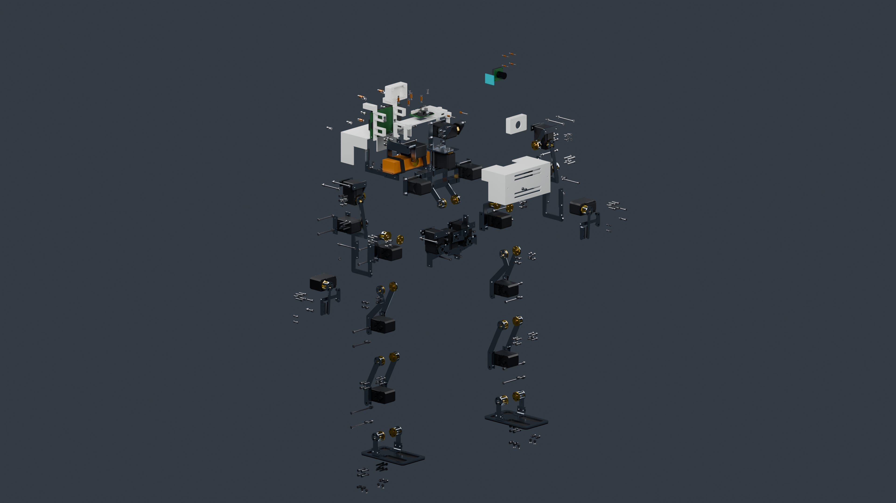
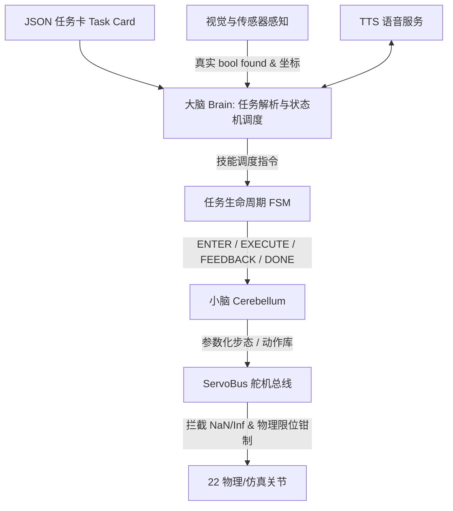
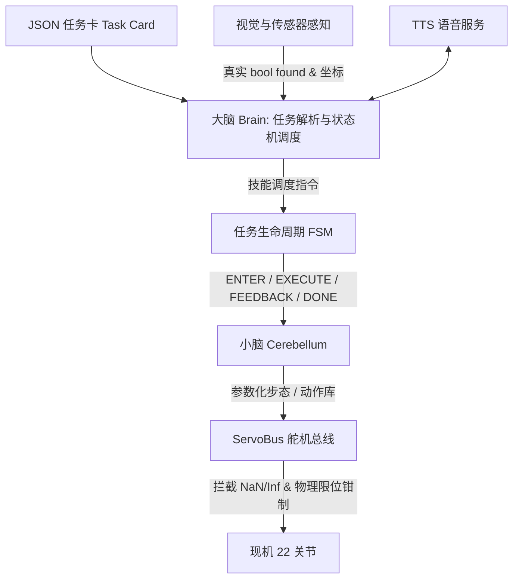

# A.T.R.I. (Autonomous Tabletop Robotic Intelligence)

> **ATRI-v2 A 路线（当前 main）**：20 DOF 桌面人形重构。**20×Feetech STS3215-C018（12 V，额定 0.98 N·m）**，6061 铝夹层承力 + **2.4 mm PETG 不透明哑光白**外壳，开放骨盆框架，髋/腰双侧支承，**单舵机两指夹爪**（固定指 + 活动指 + 指垫 + 隔柱 + 支承），**单电池**，头部前侧 VL53L1X 预留。
>
> 当前机构与软件入口均为 **20 DOF、无 hip_yaw**，口径以 [`design/v2/`](design/v2/README.md) 与 [`software/atri/`](software/atri/README.md) 为准。转向是髋 roll 占位，**G4 仍开放**。文末[附录](#附录现机-22-dof-软件与旧-cad未迁移到本机构) 是冻结的旧 CAD / 22 DOF 世界，不是当前入口。




> 上图：**CAD 路径追踪（Cycles HIP）审查渲染，不是实物照片**。爆炸图是装配分解，不是实物拆解。仓库当前没有任何已制造整机。零件表见 [`exploded-parts.md`](design/v2/out/render4k/exploded-parts.md)。

[](design/v2/out/sim/atri_v2.urdf)
[](design/v2/out/ATRI-v2-BOM.md)
[](design/v2/MANUFACTURING-NOTES.md)
[](software/atri/README.md)
[](design/v2/out/gates.json)
[](design/v2/out/%E8%B4%A8%E9%87%8F%E8%B4%A6.md)
[](#开源声明与许可证-notice--license)

```
20 DOF v2 机构（头 2 · 躯干 2 · 腿 4+4 · 臂 4+4，无 hip_yaw）  ·  20×C018 12V  ·  零位 CAD 外包络 466.5 × 188 × 295 mm  ·  已计质量 ≈2469 g（超 2450 g 硬顶，未计齐）  ·  软件 20 DOF  ·  Python 3.14
```

---

## 当前方案是什么 / 不是什么

**是：**

- **A 路线（铝 + PETG）实装审查设计。** 承力件为 6061 铝夹层（激光平板 + 标准角铝/铝管 + 局部转接），外壳为 2.4 mm 不透明哑光白 PETG/TPU。
- **20 DOF、无 hip_yaw 的新机构。** 骨盆改为开放框架、局部角铝转接与外部壳体夹持；髋侧摆与腰侧摆均改为**前后双侧支承**（后角铝 + 自由后盘 + 轴端保持件）。骨盆输出转接件已重画以避开中框碰撞。
- **单舵机两指夹爪。** 每只手一只 C018，固定指 + 活动指 + 指垫 + 隔柱 + 支承；没有双手舵机方案。
- **单电池方案。** 仅一只 Gens Ace GEA223S25T3GT（3S 2200 mAh）按实际包络进入主装配；第二包与扩展托盘已移除。想加第二包是**受门禁的提案**，不在主装配里，见 [`POWER-EXPANSION.md`](design/v2/POWER-EXPANSION.md)。
- **传感器预留。** VL53L1X 作为头部前侧 20×24×1.6 mm 夹扣/胶粘预留包络进入主装配，**未虚构厂商安装孔**。

**不是：**

- **不是已打样整机。** CAD 审查、加工文件、光追图同源输出，但**没有已制造实物**。CAD 审查 ≠ 打样 ≠ 赛题验证。
- **不是制造放行版。** `design_mass_closed: false`、`physical_mass_verified: false`，G0–G4 全部开放。
- **不是真机闭环，也不是 G4。** 仓库里的 5/5 Mock / Webots 运动学联调属于 **20 DOF 软件流程**，**不能当作 v2 硬件的赛事通过证据**。

---

## 当前状态与门禁

| 维度 | 现状 | 说明 |
|---|---|---|
| **阶段** | CAD 审查（design-provisional） | 同源 STEP/STL/3MF/DXF/URDF/WebGL，见[可下载产物](#可下载与审查产物) |
| **零件数** | 装配快照当前 **1030** 件 | `assembly-snapshot.json` 同源导出 **1030** 件，已去掉第二块电池。**这不是放行数字。** |
| **质量账** | 已计 **≈2469 g**，设计目标 2300 g，硬顶 2450 g | **超硬顶**；未计线束、相机、总线板、降压板、IMU、音频等，**不得填 0**。见 [`质量账.md`](design/v2/out/%E8%B4%A8%E9%87%8F%E8%B4%A6.md) |
| **门禁 G0–G4** | **全部 OPEN** | G0 购物车、G1 温升、G2 单腿质量、G3 赛方定义、G4 无 hip_yaw 转向误差。见 [`gates.json`](design/v2/out/gates.json) |
| **软件对齐** | 20 DOF 拓扑已迁；T1–T5 可在 Mock/Webots 运动学联调 | 转向是髋 roll 占位，**G4 未关闭**。无硬件 5/5 ≠ 真机通过。见 [`T1-T5-HARDWARE-ALIGNMENT.md`](design/v2/T1-T5-HARDWARE-ALIGNMENT.md) |
| **验证边界** | 几何/装配审查，非强度/热/续航 | CAD 有效网格、零位无相交**不等于**强度、走线或量产合格 |

> **口径纪律**：`release_ready` 为 `false`。任何"已打样 / 已通过验证 / 5/5 真机闭环 / 30 分钟续航"的表述都不成立，不要写进材料。

---

## 关键链接

| 主题 | 文件 |
|---|---|
| **A 路线工程入口** | [`design/v2/README.md`](design/v2/README.md) |
| 打样工艺与放行条件 | [`design/v2/MANUFACTURING-NOTES.md`](design/v2/MANUFACTURING-NOTES.md) |
| 髋/腰双侧支承集成 | [`design/v2/DUAL-SUPPORT-INTEGRATION.md`](design/v2/DUAL-SUPPORT-INTEGRATION.md) |
| T1–T5 软硬件对齐 | [`design/v2/T1-T5-HARDWARE-ALIGNMENT.md`](design/v2/T1-T5-HARDWARE-ALIGNMENT.md) |
| 结构理论初筛 | [`design/v2/STRUCTURAL-VALIDATION-PLAN.md`](design/v2/STRUCTURAL-VALIDATION-PLAN.md) |
| 电源扩展（提案，非主装配） | [`design/v2/POWER-EXPANSION.md`](design/v2/POWER-EXPANSION.md) |
| BOM | [`design/v2/out/ATRI-v2-BOM.md`](design/v2/out/ATRI-v2-BOM.md) |
| 质量账 | [`design/v2/out/质量账.md`](design/v2/out/%E8%B4%A8%E9%87%8F%E8%B4%A6.md) |
| 当前工程核验 / 门禁 | [`ATRI-v2-工程验证.md`](design/v2/out/ATRI-v2-%E5%B7%A5%E7%A8%8B%E9%AA%8C%E8%AF%81.md) · [`gates.json`](design/v2/out/gates.json) |
| 制造清单 | [`design/v2/out/铝件-加工清单.md`](design/v2/out/%E9%93%9D%E4%BB%B6-%E5%8A%A0%E5%B7%A5%E6%B8%85%E5%8D%95.md) · [`PETG-打印清单.md`](design/v2/out/PETG-%E6%89%93%E5%8D%B0%E6%B8%85%E5%8D%95.md) |

---

## 自由度构成（20 DOF，无 hip_yaw）

| 部位 | DOF | 关节 |
|---|---|---|
| 头部 | 2 | `head_yaw`, `head_pitch` |
| 躯干 | 2 | `trunk_roll`, `trunk_pitch` |
| 左腿 | 4 | `left_hip_roll`, `left_hip_pitch`, `left_knee_pitch`, `left_ankle_pitch` |
| 右腿 | 4 | `right_hip_roll`, `right_hip_pitch`, `right_knee_pitch`, `right_ankle_pitch` |
| 左臂 | 4 | `left_shoulder_pitch`, `left_shoulder_roll`, `left_elbow_pitch`, `left_gripper` |
| 右臂 | 4 | `right_shoulder_pitch`, `right_shoulder_roll`, `right_elbow_pitch`, `right_gripper` |

- **`left_hip_yaw` / `right_hip_yaw` 已移除**，本机构不恢复 yaw；无 hip_yaw 的转向误差属 G4 未关闭项。
- 关节名以 [`design/v2/out/sim/atri_v2.urdf`](design/v2/out/sim/atri_v2.urdf)（20 revolute）为准。

---

## 设计口径与关键参数

| 维度 | 当前口径 | 说明与出处 |
|---|---|---|
| **自由度** | 20 DOF，无 hip_yaw | 头 2 · 躯干 2 · 腿 4+4 · 臂 4+4 |
| **舵机** | 20× Feetech STS3215-C018，12 V，**连续额定 0.98 N·m** | 不以堵转 2.94 N·m 当额定；详细来源与真实性见 [`design/v2/README.md`](design/v2/README.md) |
| **结构** | 6061 铝夹层（激光平板 + 标准角铝/铝管）+ 2.4 mm PETG 不透明哑光白外壳 | 承力路径含髋/腰双侧支承 |
| **零位 CAD 外包络** | **466.5（高）× 188（宽）× 295（深）mm** | `assembly-snapshot.json` bbox（实际几何，非旧示意盒）。解析骨架包络见 `profile.py:envelope_mm()` = 466.5 × 185 × 128 mm。比赛包络量法待 G3 书面确认 |
| **骨架尺寸（mm）** | 足 120×70，小腿 78，大腿 78，hip_stack_z 32，hip_width 80，shoulder_width 150，上臂 58，前臂 60 | [`design/v2/profile.py`](design/v2/profile.py)；站高取 `standing_height_mm()` = 466.5 mm |
| **质量** | 已计 **≈2469 g**（铝 283 件 + PETG 8 + TPU 6 + 紧固件 444 + 隔柱 14 + 20 舵机 + 单电池 + Pi 4B） | 设计目标 **2300 g**、硬顶 **2450 g**，**超硬顶**；未知项未计入。见 [`mass-ledger.json`](design/v2/out/mass-ledger.json) |
| **扭矩口径** | walk k=1.4：0.761 N·m（利用率 77.6%）；hold k=2：1.086 N·m，**超额定** | 额定 0.98 N·m；hold 场景踝仍超额定 |
| **电池** | **仅一只** Gens Ace GEA223S25T3GT（3S 2200 mAh，107×33×22 mm，169 g） | 第二包与扩展托盘已移除；扩容为受门禁提案 |
| **预算** | close 估算 ≈¥3137、retail ≈¥3961 | **均非已锁购物车**；G0 要求 close ≤ ¥3000 且 12V SKU 截图，当前**不通过** |

---

## 仓库地图（当前 main）

```
ATRI/
├── design/
│   ├── v2/                         # ★ A 路线当前机构（20 DOF，main 主入口）
│   │   ├── profile.py              #   机构尺寸、限位、采购件接口与预算参数
│   │   ├── *_cad.py / *_mount.py   #   当前结构与安装件
│   │   ├── cad_export.py           #   同源 STEP/STL/URDF/WebGL 输出
│   │   ├── manufacturing.py        #   激光毛坯、角铝参考模板、定向 3MF
│   │   ├── mass_ledger.py          #   质量账生成
│   │   └── out/                    #   同源审查产物（CAD / 制造 / Blender / 质量 / 门禁）
│   ├── cad/                        # 旧 22 DOF CadQuery 建模（冻结）
│   ├── atri.urdf                   # 旧 22 DOF URDF（冻结）
│   └── robot_model.json            # 旧 22 DOF L1 模型（冻结，历史口径）
├── software/atri/                  # v2 20 DOF 控制软件栈（无 hip_yaw）
├── webots/                         # 默认 atri_v2.wbt（20 DOF）；atri_22dof.wbt 为冻结现机世界
├── docs/                           # 工程过程记录、立项调研与参赛材料
├── 固件/                           # 接线与寄存器语义（不是已烧录固件）
├── ppt/                            # 答辩交付物
└── NOTICE                          # 第三方参考资产合规声明
```

> `design/cad/`、`design/atri.urdf`、`design/robot_model.json` 与 `webots/worlds/atri_22dof.wbt` 属**冻结的现机 22 DOF / 旧 CAD 线**。软件与默认 Webots 世界已迁到 20 DOF，见文末[附录](#附录现机-22-dof-软件与旧-cad未迁移到本机构)。

---

## 可下载与审查产物

- [完整 STEP 压缩包](design/v2/out/packages/ATRI-v2-review.step.gz)（解压为未简化的装配 STEP）
- [完整打样审查包](design/v2/out/packages/ATRI-v2-manufacturing-review.zip)（DXF、3MF、STL 与逐件清单）
- [URDF 与完整网格包](design/v2/out/packages/ATRI-v2-simulation-review.zip)
- [Blender 可见装配场景](design/v2/out/blender/ATRI-v2-assembly-review.blend)
- [文件 SHA256](design/v2/out/packages/checksums.json)
- 逐件装配身份 / 材料 / 加工文件：`design/v2/out/manufacturing/manifest.json`

**出图状态**：`design/v2/out/blender/renders/` 为 GPU 光追 CAD 审查图（含 `product_iso.png`、`service_exploded.png` 等）。`design/v2/out/render4k/` 为 4K 展示图：整机前/后、腰-手-传感器细节、**无标号爆炸图**（不提交带编号版）。

> 此处所有文件均为**未放行审查版**。原始 STEP 超过 GitHub 单文件限制，故以无损 gzip 保存；压缩包经解压哈希/CRC 检查。

---

## 复现命令

所有命令在此工作树根目录执行。CadQuery 必须使用本仓库 `.venv-cad`（Python 3.12）。

```bash
PYTHONPATH=design python3 -m unittest software.atri.tests.test_v2_rebuild -q
PYTHONPATH=design .venv-cad/bin/python -m unittest discover -s software/atri/tests -p 'test_v2_*.py' -q
PYTHONPATH=design python3 -m v2.generate
PYTHONPATH=design .venv-cad/bin/python -m v2.cad_audit
blender --background --python design/v2/blender_build.py -- --out design/v2/out --samples 64
```

生成器严格从同一次 `cad_export.build_items()` 导出；缺件或无效实体会报错，不静默替换、跳过或合并丢件。

---

# 附录：冻结的现机 22 DOF 旧 CAD 与旧仿真世界

> **本节描述的是冻结的现机 22 DOF 旧 CAD / 旧仿真世界，不是当前软件入口。** 软件栈与默认 Webots 世界已迁到 20 DOF。下文历史记录里的 22 关节、`hip_yaw` 与旧包络**不代表 A 路线机器人**。无硬件 5/5 与运动学联调不能当作 v2 真机通过。

## 项目定位（现机 22 DOF）

> **全称**：AUTONOMOUS TABLETOP ROBOTIC INTELLIGENCE（桌面自主人形智能）
> **一句话定位**：一台能自己看、自己想、自己走的桌面双足机器人。
> **项目团队**：何浩睿 · 周柏宇 · 胡晟瑞 · 王旭琪 · 张景昆；**指导教师**：陈妍 · 李璐

面向中国国际大学生创新大赛（人形机器人专项·小人形组）及高校具身智能实验教学场景，现机方案直面三大痛点：

1. **设备贵**：全机统一采用 22 只总线舵机，将新增采购预算压至 **2725–3260 元**（全口径 3350–3950 元，扣除实验室已有边缘板与调试件）。
2. **算法散**：底座抽离出统一 FSM 调度器与 Skill 契约规范，换场景仅需换一张结构化 JSON 任务卡。
3. **断网瘫**：单目轻量视觉、离线 TTS 引擎与状态机全板载，实现**全离线 0 次网络出站闭环**。

赛题规约的五项任务（**属软件流程 / Mock，不是 v2 真机验证**）：

- **人脸识别**（T-01，现机软件）：YuNet + SFace + 人脸库 + 显式拒识（LFW 口径，**不是实机 / 不是 v2 机构**）；Haar 兜底保留；
- **二维码指令响应**（T-02）：解算二维码载荷中的标准 JSON 业务指令并状态转移；
- **目标物品搬运**（T-03）：夹爪开合与步数换算已接入任务卡；目标检测与对齐闭环尚未做，感知失败则停；
- **自主足球踢球**（T-04）：单目测距定位球体，行进至击球区并执行参数化侧踢；
- **编排动作舞蹈**（T-05）：多姿态关键帧库回放，配合离线语音节拍完成展示。

## 快速上手（当前 20 DOF 软件）

核心控制软件位于 `software/atri/`，仅依赖 **Python 3.14 标准库**（零 pip 依赖）。无硬件连线、无 GPU 时可直接跑通任务卡、FSM 到虚拟舵机总线的完整闭环：

```bash
# 1. 进入软件核心目录
cd software/atri

# 2. 运行主软件栈单元测试（CadQuery 用例需仓库根 .venv-cad，系统 3.14 会报缺依赖）
python3 -m unittest discover -s tests

# 3. 运行赛题五项任务无硬件闭环演练（--fast 跳过动作等待）
python3 run_demo.py --fast

# 4. 运行 Webots 控制器及映射离线自检（切回仓库根目录）
cd ../..
python3 -m unittest discover -s webots/tests
```

## 历史做实记录（含 hip_yaw 时期）

以下章节来自更早的 T-01～T-05 做实记录。部分文字仍按当时 22 DOF / `hip_yaw` 口径写。**不能当作 A 路线 20 DOF 硬件已经通过赛题。**

## 人脸识别 T-01（2026-09-12 做实）

T-01 现在是一条**真识别链路**：YuNet 检测 → 5 关键点对齐 → SFace 128 维特征 → 人脸库余弦比对 → 显式拒识。
全离线、CPU、无 GPU。原「Haar 检测 + 参数兜底」路径**保留可用**，真识别通路优先。

```bash
# 一次性环境（仓库根目录）—— 用仓库内自带的 Python 3.14，见 docs/process/工程说明.md §1.1b
./.python/bin/python3 -m venv .venv-face
.venv-face/bin/pip install "opencv-contrib-python==4.11.0.86" numpy pyarrow
#   ⚠ numpy 不要 pin 到 <2：numpy 1.x 没有 3.14 的 wheel

# 拉模型（约 37 MB，带 sha256 校验；模型不入库）
.venv-face/bin/python software/atri/tools/fetch_models.py

# 注册人脸（只写特征向量与姓名，原图不入库）
.venv-face/bin/python software/atri/tools/face_enroll.py \
    --from-dir 本地数据/faces/team --db software/atri/config/face_db.json --append

# 用一张图真跑 T-01（没有摄像头也能验证）
cd software/atri && ../../.venv-face/bin/python run_demo.py --fast \
    --face-image ../../本地数据/faces/e2e/Tony_Blair_0040.jpg \
    --face-db ../../本地数据/faces/demo_face_db.json

# LFW 评测（出成功率 / 混淆矩阵 / EER 曲线）
.venv-face/bin/python software/atri/tools/face_eval.py --hard --compare-haar \
    --report design/handoff/T-01-LFW评测报告.md
```

**LFW 实测**（`design/handoff/T-01-LFW评测报告.md`）：检测 100%；rank-1 5 人 100%、
困难协议（末位选人 + 单张注册 + 随机划分）20 人 99.5% / 50 人 98.6%；
阈值在**不重叠的 20 人身份池**上标定，EER 1.06%。

> ⚠️ 数字来自 **LFW 公开数据集**，**不是实机摄像头实测**；距离档与现场光照未测。
> 人脸库为空时对所有脸只会说「不认识」，这是刻意行为。

> 📌 **T-01 对外口径已按赛题原文落地为「人脸识别」**。退化通路的 `expect_names[0]` 兜底仍保留，
> 但必须打印 `source="params"`，不得写成识别成功率。PPT 成品未改（等团队重生成）。
> 差异归档：`design/handoff/T-01-口径差异清单.md`。

---

## 二维码循迹 T-02（2026-09-12 做实）

赛题原文是「识别二维码并按**指示路径**行走」，而原先的 payload 只能表达**一条指令**。
本次补上路径表达、三解码器对照、多段执行与标称位移。

**路径格式**（旧格式继续可用，现场已印的码不作废）：

```json
{"schema":"atri.path.v1",
 "path":[{"action":"walk","steps":3},{"action":"turn","deg":90},{"action":"walk","steps":2}]}
```

```bash
# 拉二维码模型（约 1 MB，带 sha256 校验；模型不入库）
.venv-face/bin/python software/atri/tools/fetch_models.py --only qr

# 生成一张路径二维码（并打印版本 / 模块数 / 像素尺寸）
.venv-face/bin/python -m atri.qrgen \
    --path '[{"action":"walk","steps":3},{"action":"turn","deg":90}]' -o qr_path.png

# 鲁棒性评测：27 场景 × 3 解码器 + 10 组指令回放
.venv-face/bin/python software/atri/tools/qr_eval.py \
    --report design/handoff/T-02-二维码识别鲁棒性报告.md
```

**实测**（`design/handoff/T-02-二维码识别鲁棒性报告.md`）：

| 解码器 | 判据条件成功率 | 全扫描 | 平均单帧 |
|---|---|---|---|
| `opencv`（自带） | 50.0% | 66.7% | 105.7 ms |
| `aruco`（自带） | 66.7% | 59.3% | 54.0 ms |
| **`wechat`（1 MB 模型）** | **100%** | **88.9%** | **25.9 ms** |

- **主用 `wechat`**：判据条件下 6/6 全过，且**最快**（标准 `QRCodeDetector` 反而最慢）。
- **指令执行正确率 100%（10/10）**（编码 → 真解码 → 真执行，逐段比对）。
- **硬边界是码的像素大小**：<60 px（名义 >1 m）三种全失败；旋转 60°、暗光 ×0.4、噪声 σ=30 都扛得住。
  → 现场该做的是**印大一点 / 走近一点**，不是换算法。

> ⚠️ 畸变是**程序合成**的，不是真实相机拍的；**到位误差（S-02 的 ≤50 mm）未测** ——
> 小脑层没有位移/里程计，路径终点只有标称值（`atri.odometry`，标注 `nominal-uncalibrated`）。

## 物品搬运 T-03（2026-09-13 做实）

队友已把"多轮横向伺服闭环"做进来了（`0f65892` / `1cf0a8d`）。本次补的是它缺的那三件：
**放置区、可标定、可复跑的证据**。

```bash
# 评测（合成图 + 一维几何 + 真检测器/真技能；需要 numpy+opencv）
.venv-face/bin/python software/atri/tools/carry_eval.py \
    --report design/handoff/T-03-搬运-方案与评测报告.md \
    --json design/results/t03_carry_eval.json
```

**三步行为**（`skills/carry.py`）：

1. **对准目标物**：多轮增量偏航闭环；偏差超 `grasp_tolerance_cm` → 判失败、**不下发抓取**；
   没进死区但在容差内 → 允许夹，但必须回报 `aligned=False`（不把"凑合夹"说成"对准了"）。
2. **夹取 + 平移**：`grasp → walk(steps)`（步长名义 2 cm，未标定）。
3. **对准放置区**：通道接入了才做；**地标没看见 → 停住不释放**；通道完全没接入 →
   按任务卡参数释放，但结果里写 `place.status="channel-unavailable"`。

**参数全部可标定**：优先级 `任务卡 params > config/carry.json > 代码默认值`
（`atri/tuning.py`；这份 JSON 随代码发布时**只有说明、没有覆盖值**，有测试盯着）。

**跑出来的数字**（`design/handoff/T-03-搬运-方案与评测报告.md`，**合成图口径**）：

| 项 | 结果 |
|---|---|
| 色块检测（判据条件内） | **23/23 检出**，横向误差 ≤0.05 cm；全扫描 32/33（唯一失败：亮度 ×0.3，HSV 的 V 门限） |
| 遮挡的影响 | 全高挡条挡左侧 20/40/60% → 检出中心**系统性右偏 0.40/0.65/0.95 cm** |
| 端到端闭环（图像在环） | 代码默认 **11/20** → 推荐参数（`max_iters=15, step_gain=1.0`）**20/20** |
| 参数边界 | 12 cm 物距下：默认只纠得动 **3.4 cm**，推荐参数覆盖整个视场 ±6.93 cm |

> ⚠️ **两个数字口径必须一起说**：① 全部来自**程序合成图像 + 一维几何**，不是实机相机；
> ② 现有 Mock 的 `gain=1.5 cm/°` 等价于"物距 86 cm"，比桌面真实物距（8–20 cm，gain 0.14–0.35）**乐观约 7 倍**。
> **实机抓取成功率仍未测**（未测项清单 B6）；实物到手后第一步是量真实 gain 再回填 `config/carry.json`。

## 体育运动-踢球 T-04（2026-09-13 验收与评测）

```bash
# 评测：合成图上的绿球检测 + 图像/几何在环闭环 + 参数边界表
#   A 段要 cv2；用基准解释器跑则 A 段自动跳过并在报告里写明
.venv-face/bin/python software/atri/tools/kick_eval.py \
    --report design/handoff/T-04-踢球-方案与评测报告.md \
    --json design/results/t04_kick_eval.json
```

**跑出来的数字**（`design/handoff/T-04-踢球-方案与评测报告.md`）：

| 项 | 结果 |
|---|---|
| A 段 绿球检测（**程序合成图**，真 `OpenCVPerception.detect_ball`） | 判据条件内 **23/24**、全扫描 **32/34**；横向误差 ≤0.05 cm |
| B 段 图像在环闭环（真 `KickSkill`） | 代码默认 **24/26 技能 ok、闭环收敛 11/26**；推荐参数（`max_iters=15, step_gain=1.0`）**收敛 24/26** |
| C 段 参数边界表 | 解析边界 vs 真链路逐点校验，**0 行不一致** |

> ⚠️ **「技能 ok」≠「球被踢动」**：踢球是预标定轨迹，"不收敛也踢"，所以 ok 数高于收敛数；
> S-04 的「球位移 ≥100 mm」判据**未测**。`gain=1.5 cm/°` 是假设值（等价物距 86 cm，
> 比桌面真实值乐观约 7 倍），光照轴未扫。**实机踢球成功率仍未测**（未测项清单 B7）。

## 娱乐休闲-舞蹈 T-05（2026-09-13 验收与评测）

```bash
# 门闩与关键词匹配（零依赖，不碰真引擎）
.python/bin/python3 software/atri/tools/dance_eval.py

# 真引擎解码证据（需独立 venv 里装 vosk + 中文小模型；缺件会优雅跳过并写明缺什么）
.python/bin/python3 software/atri/tools/asr_decode_eval.py \
    --asr-python /tmp/atri-asr/venv/bin/python \
    --vosk-model /tmp/atri-asr/models/vosk-model-small-cn-0.22 \
    --report design/handoff/T-05-语音真解码验证报告.md \
    --json design/results/t05_asr_decode.json
```

**跑出来的数字**（`design/handoff/T-05-语音真解码验证报告.md`，vosk 0.3.44 + 中文小模型，35 条 = 5 句 × 7 档信噪比）：

| 解码模式 | 白名单命中 | 其中**真的说出被念的词** | 白名单外负样本误接受 |
|---|---|---|---|
| 语法约束（技能默认） | 21/21 | **7/21** | 0/7 |
| 自由解码 | **17/21** | 17/21 | 0/7 |

- 自由解码按噪声档：干净/70/50/30/20 dB **各 3/3**、10 dB 2/3、**0 dB 0/3**。
- 门闩（`dance_eval.py`）：关键词匹配 6/6、四问全 OK（白名单外不跳、听不清必须失败并播提示语）。

> ⚠️ **两条必须一起说**：① **"约束模式 21/21"不能读成"识别很准"**——白名单被当成语法喂给解码器后，
> 引擎只会吐白名单词（实测三个变体全被压成 `跳舞`），它证明的只是"白名单外不会被误接受"；
> ② **S-05 的 30/50/70 dB 噪声轴实测区分不出好坏**（30 dB 仍全中），素材是 `say` 合成音 +
> 程序白噪声，**不是现场识别率**（未测项清单 B8 仍未测）。

## ⚠️ 引用数字之前：先看未测项清单

`docs/process/未测项清单.md` 是全项目**唯一**的"没测过 / 测不了"登记表：

- ⛔ **阻断级**：样机未制造（所有实机指标的根源）、双足行走 ≥1 m、路径到位误差、
  STS3215 真实连续扭矩与温升、减重是否成立
- ⚠️ **重要级**：T-01 实机距离档、T-02 真实相机、树莓派耗时、续航、抓取/踢球成功率……
- ▫️ **背景级**：标称位移系数未标定、舵机零位未标定……
- ❓ **待主办方确认**：上肢躯干是否含头、二维码码制、路径格式……

**任何写进材料的"能做到什么程度"，先在表里搜一遍**；命中 ⛔/⚠️ 的写成"设计值/待实测"，
不要写成结论。表格里每一条都注明了"现在在哪份文档里被写成什么样、为什么没测、怎么才能测"。

---

## 分支与合并状态（2026-09-12 已合入 main）

软件线 `atri-next` 已于 **2026-09-12 合入主线**（`0533f55`，保留主线非几何修正、取其几何），
当前 HEAD 在 **`main`**，与 `origin/main` 同源；远程与本地均**不再保留 `atri-next`**
（合并前快照留在本地分支 `backup/main-pre-merge`，未推送）。**本 README 描述的就是合并后的 main。**

| 项 | 合入后口径 | 说明 |
|---|---|---|
| **整机包络** | **407（高）× 268（宽）× 160（深）mm** | 赛题上限 600×300×300；内部宽门禁 ≤270 mm **只剩 2 mm** |
| **机械零位摆放错误** | **0 对** | 合入后由 19 对清零 |
| **干涉总量** | **186 对 / 151 454 mm³**（让位不足 112 · 局部干涉 74） | 由 189 对 / 160 339 mm³ 经两次修正降下来：`6190ad4`（消全机 Top1）→ 188/156 114；`522cb85`（相机落位对齐头壳口袋 + IMU 归后桥座）→ **186/151 454**。**主会话 17:35 独立复验**；⚠️ 级为主，随几何改动小幅浮动 |
| **结构件质量** | **1383.8 g / 81 件**（CAD 实算；薄壁近似对 3 mm 壁件退化为实心 ⇒ 读作**上限**） | 合入前 1490 g，再减 **−7%** |
| **整机质量** | **≈3029.8 g（纸面推算，重量方案未定案）** | = 结构实算 + 舵机 1210 + 电子电池 316 + 线束 120；URDF 冻结基线 3436.6 g |
| **扭矩（10 个腿部关节超额定）** | 踝 **147.5%**、膝 141.2%、髋 pitch 134.1% / roll 129.4% / yaw 124.7%（占官方连续额定 0.98 N·m） | 腰 `trunk_roll` 41.1%（零姿态）/ 45.1%（最不利），**不超**；权威数字只看 `torque_check` |
| **功率 / 电池** | 平均 **15.97 A**、30 min 需标称 **10.40 Ah**（≈115.5 Wh，整包 ≈1.05 kg）；现选 3S 2000 mAh ≈13 min ⇒ **不得写"30 分钟续航"** | 工作占比 0.35 为工程估值 |
| **测试** | 主包 **699 项 OK**（零依赖环境下 skip 46）；Webots 离线桩 **41 项 OK**；CAD 布局门禁 **17 项 OK**（本机实测） | 命令见下节 |

**口径纪律**（细节见 `design/handoff/交接档案-新会话入口.md` 第四节、《答辩材料口径核对清单》）：

1. 包络顺序一律写 **高 × 宽 × 深**，与 `size_cm = [14.6, 26.3, 40.7]` 的深×宽×高顺序不同，引用时别混。
2. `❌ 摆放错误 = 0` **不等于"没有穿模"**——**实测（改前基线 189 对）里只有 5 对**是同关节配合面（`fitcheck.is_joint_mate` 判定），
   其余 184 对是 ⚠️ 级让位不足 / 局部干涉（含 12 对管-舵机族，`right_forearm__limb_tube` 有 80% 自身体积被舵机占掉）。
   `❌ = 0` 的准确含义是"**没有任何一对达到『被指派到同一块空间』的程度**（判据：重合率 ≥30% 或体积 ≥5000 mm³）"。
3. `design/cad/out/report.md` 里印的踝 1.49 N·m / 152% 是 `build_all.py` 自带的**旧简算式**；**权威力矩只认 `hardware_requirements.json` 的 `torque_check`**。
4. `design/robot_model.json` 的 **字段值已是现行值**：`installed_envelope_mm` = 407 × 268 × 160、`overall.mass_kg` = 3.036
   （`mass_budget.total_g` = 3036.4，`sum(links.mass_kg)` = 3.0367）。
   **过期的是散落在该文件里的说明文本**：`installed_envelope_mm.source`（仍称"第 6–10 轮合入后 09:06 重测"）、
   `overall.note`（仍写"实装包络见 installed_envelope_mm（**418 mm 高**）""整机 3.437 kg"）、
   以及 `changelog` 条目（`407 × 263 × 146`、`1490 g`、`3.136 kg` —— 那是 v3.0-refresh 那次变更的**历史记录**，不是现值）。
   ⇒ **字段可引，文本不可引**。

---

## 这是什么 / 不是什么

- **全离线确定性控制栈**：采用“大脑—小脑”双层架构。大脑解析 JSON 任务卡并由有限状态机（FSM）调度；小脑负责参数化步态与动作库回放。感知成败与运动熔断严格绑定。
- **主包零第三方顶层依赖**：核心调度、运动学接口、状态机与单元测试仅依赖 Python 3.14 标准库。仅在接入实体摄像头时可选装 `opencv-python-headless`，生成二维码图像时可选装 `qrcode`。
- **已弃用端到端大模型（无 VLA）**：动作均由几何步态发生器与标定动作库生成，不做不可控的端到端生成式输出。
- **视觉只做轻量几何与检测，不做深度识别**：人脸模块使用 OpenCV Haar 级联检测器截取人脸边界框，**未做高阶人脸特征比对（不能识别人是谁）**；语音交互为离线文本发音（TTS），**不包含声纹识别**；二维码采用标准几何解算。
- **软件与仿真先导，样机未整机组装**：当前处于“设计冻结 + 仿真与脱机软件全绿”状态。实体 STS3215 舵机与骨架零件处于测试备料阶段，尚未开展整机物理在环联调。

---

## 仓库地图

```
ATRI/
├── software/atri/                  # 核心控制软件栈（Python 3.14，主包零第三方依赖）
│   ├── atri/                       # 控制包：config, brain, cerebellum, bus_sts3215, bringup 等
│   ├── task_cards/                 # 五项赛题结构化任务卡 JSON（T-01 ~ T-05）
│   ├── action_library/             # 预标定关键帧动作库（walk, kick, dance, carry 等）
│   ├── tests/                      # 主软件栈单元测试（含 STS3215 假串口与 bring-up）
│   └── run_demo.py                 # 五项任务无硬件快速演练入口
├── webots/                         # 仿真工程（22 DOF 仿真世界、控制器及测试）
│   ├── controllers/atri_controller # 机器人仿真控制器及软硬件关节映射
│   ├── worlds/atri_22dof.wbt       # 22 自由度自包含 Webots 仿真世界
│   └── tests/                      # 41 项关节映射完整率、覆盖度与实际角位移测试
├── design/                         # 机构与运动学模型
│   ├── atri.urdf                   # 22 自由度运动学与动力学描述
│   ├── cad/                        # CadQuery 参数化装配源码（独立 Python 3.9.6 环境）
│   ├── drawings/                   # 关节编号图、三视图、尺寸链图、舵机布局图
│   └── handoff/                    # STS3215 规格书核验、错轴分析、技术参数交接表
├── docs/                           # 工程过程记录、立项调研与参赛材料
│   ├── process/工程说明.md          # 仓库演进说明
│   ├── contest/                    # 省赛操作手册与申报附件
│   └── research/项目文档/           # 项目综述、技术方案、BOM 与可行性核查
├── 固件/                           # 接线与寄存器语义（不是已烧录固件）
├── ppt/                            # 答辩交付物
│   └── ATRI-答辩PPT-v4.pptx        # 24 页答辩演示文稿
└── NOTICE                          # 第三方参考资产（如 SO-ARM100 模型）合规声明
```

---

## 软件架构

软件系统采用双层解耦与防御性调度设计：



1. **大脑（Cognition & FSM）**：解析标准化 JSON 任务卡，驱动 FSM 生命周期。遵循真实成败契约：感知未找到目标（严格原生布尔 `found` 判定）时立即熔断退出，杜绝虚报成功。
2. **小脑（Motion & Safety）**：管理 22 自由度拓扑，生成参数化步态或回放关键帧动作。
3. **总线防御（Bus Safety）**：`clamp_angle` 与 `deg_to_pulse` 拒绝 `NaN` / `Inf`。Mock / Webots 走 `ServoBus.set_angle` 模板；真机 `Sts3215Bus` 覆盖 `set_angle`，换算仍走 `deg_to_pulse`，不能把非有限值变成满脉冲。

详细模块设计与 API 参见 [software/atri/README.md](software/atri/README.md)。

---

## 设计口径与关键参数

项目中严禁混淆计算阶段与装配阶段的数据，核心量化指标统一规范如下：

| 维度 | 第一层：运动学与 URDF 口径 | 第二层：CAD 现行装配口径 | 说明与工程依据 |
|---|---|---|---|
| **整机尺寸** | 运动学基元 372.8 × 190 × 123 mm | **CAD 实装 407 × 268 × 160 mm**（高×宽×深） | 报名用实装。赛题上限 600×300×300；对上限余 +32 mm，但**对内部 270 mm 布局门禁只剩 2 mm**（肩部外挂错轴件的代价） |
| **结构件质量** | URDF link 质量合计 3436.6 g（历史冻结口径） | **1383.8 g / 81 件（CAD 实算，读作上限）** | 历史链 1790 → 1404 → 1490 → 1390.4 → **1383.8**；薄壁近似对 3 mm 壁件退化为实心，故为上限 |
| **整机总质量** | 历史提交口径 3437 g | **≈3029.8 g（纸面推算，重量方案未定案）** | 结构实算 1383.8 + 舵机 1210 + 电子件与电池 316 + 线束紧固件 120 |
| **腿部关节扭矩需求** | 随质量口径变 | **10 个腿部关节超额定：踝 147.5%、膝 141.2%、髋 pitch 134.1% / roll 129.4% / yaw 124.7%** | 占官方连续额定 0.98 N·m；减重路径 A/B/C 按 0.98 均未达标 |
| **扭矩判断基准** | **0.98 N·m（官方额定负载 10 kg·cm @12V，主判据）** | 1.47 N·m（堵转×50%，仅峰值参考） | 权威数字只看 `hardware_requirements.json` 的 `torque_check`；`out/report.md` 的 1.49 N·m 是旧简算式 |
| **腰部扭矩需求** | — | **`trunk_roll` 41.1%（零姿态）/ 45.1%（最不利），不超额定** | 修正力臂口径后由 187–194% 回落；上半身重力 + 惯性 |
| **电池与续航** | 现选 3S 2000 mAh（约 13 min） | 30 min 需标称 **10.40 Ah（≈115.5 Wh，整包约 1.05 kg）** | 平均电流约 15.97 A（工作占比 0.35 为工程估值）。答辩不要写 30 分钟续航 |
| **错轴量 (Stagger)** | — | **30–35 mm** | 沿舵机输出轴向外平移抽出，解决 19.6 mm 间距下两只 35 mm 舵机机体干涉；8–12 mm 属端面净距，禁止用作错轴量 |
| **BOM 成本** | 新增采购档：**2725–3260 元** | 全口径核算：**3350–3950 元** | 新增档扣除了实验室已有的边缘计算板与 STM32 调试件 |

---

## 运行平台与环境支持

- **基准平台**：基准运行环境为 Linux aarch64 配合 Python 3.14。由于多数嵌入式发行版未自带 Python 3.14，板端推荐源码编译安装。
- **算力选型**：BOM 清单中的树莓派 4B（4GB）仅作为算力基准与成本测算参考物，控制软件面向标准 Linux 接口编写，不绑定树莓派专有生态。
- **语音引擎**：Linux 下依次探测 `piper`、`espeak-ng`、`espeak`、`spd-say`，也可通过环境变量 `ATRI_TTS` 指定引擎；未检测到外部命令时自动降级为安全的 `MockTTS`。
- **CAD 依赖隔离**：CAD 装配基于 CadQuery 2.5.2 与 OpenCASCADE，固定运行在专用的 Python 3.9.6 虚拟环境（`.venv-cad`），与主软件环境完全隔离。

---

## 当前工程状态

| 模块 | 已完成 (Done) | 进行中 / 待真机验证 (WIP) | 规划中未做 (Planned) |
|---|---|---|---|
| **控制软件** | • 5/5 项任务卡快速演练闭环<br>• 主包 + Webots 离线测试<br>• FSM 熔断、NaN 拦截与协作式超时<br>• STS3215 真机总线（假串口可单测） | • 真实摄像头采集帧率与延迟调优<br>• Linux 本地离线 TTS 音色配置<br>• 中位标定：默认写 31，官方一键置中是 40=128 | • STM32 固件接管小脑（`固件/README.md` 为接线与语义，不是已烧录固件） |
| **仿真环境** | • 22 DOF 自包含 Webots 世界与控制器<br>• 41 项映射覆盖度、绑定完整率与实际角行程离线测试通过 | • 步态在环动力学平衡调优 | • CI 无头环境下的自动化 3D 物理交互评测（受限于 Linux CI 无头图形环境） |
| **机械结构** | • 22 DOF URDF 描述文件<br>• 髋肩 30–35 mm 错轴改型（解决对咬干涉）<br>• 基于 `kind` 稳定元件装配 | • 样机 3D 打印件加工与备件装配<br>• 错轴受力件打印强度测试 | • 整体铝合金骨架 CNC 批量加工 |
| **电气硬件** | • 关节动力学推导与选型验证<br>• BOM 成本核算与分级采购清单<br>• 功率缺口已写入交接包（30 min 需 **10.40 Ah**） | • 采购单只 STS3215 12V 舵机实测温升与持续工作力矩<br>• 电池仓扩容或外供方案（现选 3S 2000 mAh 不够 30 min） | • 专用供电管理与电流监测集成板设计 |

---

## 历史改动与工程演进记录

为保留工程演进脉络并供评审复核，本节归纳软件线并入主线过程中的关键变更。该软件线原名 `audit-fixes`、后改名 **`atri-next`**，并已于 **2026-09-12 合入 `main`**（`0533f55`）；下表数字为**各次变更当时的留档**，现行口径以上文口径表为准。

### 1. 审计修复（原 `audit-fixes`，已并入 `atri-next`）

- **纠正技能假成功**：修复感知失败仍盲目上报 ok 的漏洞。未检测到目标时立即熔断后续动作（`software/atri/tests/test_brain.py`）。
- **严格布尔校验**：`found` 字段强制校验原生 `bool` 类型，拒绝 `"False"` 字符串等非布尔真值隐患（`tests/test_perception.py`）。
- **消除动作重复下发**：修正踢球与舞蹈技能中因状态重复调用导致的底层运动指令重复下发（`tests/test_brain.py`）。
- **协作式超时机制**：引入 `abort_event` 标志位，长轨迹在帧边界主动检查退出；归零动作 `home()` 仅在主线程退出后执行一次（`software/atri/tests/test_brain.py` 与 `test_fsm.py`）。
- **总线非数防御**：`clamp_angle` 拦截 `NaN` / `Inf`（`tests/test_cerebellum.py`）。真机路径另在 `deg_to_pulse` 拒绝非有限值，避免 `Sts3215Bus` 把 NaN 写成满脉冲（`tests/test_config.py`、`tests/test_bus_sts3215.py`）。
- **仿真严密三层判据**：Webots 离线测试重构为 22 关节全覆盖、全绑定、真实行程 > 1°，杜绝未绑定也能绿灯的假阳性（`webots/tests/` 41 项通过）。
- **纠正数据口径**：废除以 1.47 N·m 峰值掩盖过载的口径，明确以 0.98 N·m 额定连续扭矩为主判据。额定订正后 30 min 电池需求升到 **11.83 Ah**（不是 4.53 Ah）。

### 2. 已从 origin/main 合入的机械与真机改动 (CAD / Bus)

自分叉点 `c5491d9` 到 `60d8611`：
- **装配判据统一**：`fitcheck.py` + `interference.py`；第 5 轮后 `pair_inspect.py` 把干涉体变回零件坐标系。
- **电子件按 `kind` 落座**，不再靠名称字符串。
- **髋肩错轴 30–35 mm**：`cluster_horn_arm` + `cluster_outrigger` + `backpack_plate`。宽从 223 吃到 **263 mm**。
- **口径订正**：实装包络 **407 × 263 × 146 mm**；结构 **1490 g / 81 件**；整机 3136 g 纸面推算。
- **STS3215 真机总线** `software/atri/atri/bus_sts3215.py`（SYNC WRITE、遥测、假串口测试）+ `固件/README.md`。
- **功率测试**改为「缺口必须被记录」，不许用绿测掩盖 11.83 Ah 超标。

### 3. `atri-next` 收口（已并入 main）

- 分支从 `audit-fixes` 改名为 **`atri-next`**；远程旧名已删，tag `audit-fixes-frozen` 指向改名前的 `13b9ab2`。
- ~~不对 `main` 开合入 PR~~ → **2026-09-12 已合入主线**：`0533f55` 整合 atri-next 第 6–10 轮 CAD 改造（保守合并：几何取其版本、非几何修正保留主线）。合入后 ❌ 摆放错误 19 → **0**、干涉 266 134 → **≈160 300 mm³**。
- 真机 `deg_to_pulse` / `Sts3215Bus.set_angle` 对 NaN/Inf 抛错且不发帧。
- T-01 文案曾改为「人脸检测迎宾」；**2026-09-12 按赛题原文改回「人脸识别」**（真识别通路优先，退化通路保留 `source`）。

### 4. 合入后的口径重测（本次）

- 整机包络重测为 **407（高）× 268（宽）× 160（深）mm**（合入前记录的 263 宽 / 146 深作废）；内部 270 mm 宽度门禁**只剩 2 mm**。
- 结构件实算 **1383.8 g / 81 件**（合入前 1490 g，−7%）；整机纸面推算 **≈3029.8 g**；URDF 冻结口径 3.0367 kg（回灌于 09:06，见 `design/handoff/交接档案-新会话入口.md` §十四）。
- 力矩力臂口径修正：`trunk_roll` 由 187–194% 回落至 **41.1%（零姿态）/ 45.1%（最不利）**，超额定关节由 11 个收敛为 **10 个腿部关节**。
- 测试规模主包以当场 `unittest` 为准：**2026-09-13 收口复核 `Ran 699 tests OK (skipped=46)`**（CPython 3.9.6 零依赖环境；干净 clone 复现）；Webots 离线桩 **41 项 OK**；CAD 布局门禁 17 项。历史数字 437 / 508 / 556 / 579 / 603 / 629 / **639（第 12 轮收口口径）** 不再引用。
  装齐可选依赖后 skip 项会减少；引用时写命令与解释器，不要混用旧徽章。
  复现：`cd software/atri && ../../.python/bin/python3 -m unittest discover -s tests`（解释器来源见 `.python/VERSION.txt`）。

> 待回灌项：`design/robot_model.json` 的 `installed_envelope_mm` 与 `overall.mass_kg` 两字段仍是过期值，需要一次"包络/质量回灌"提交把它对齐到 `design/cad/out/report.md`。

---

## 软件架构（现机 22 DOF）



1. **大脑（Cognition & FSM）**：解析标准化 JSON 任务卡，驱动 FSM 生命周期；感知未找到目标（严格原生布尔 `found`）时立即熔断退出。
2. **小脑（Motion & Safety）**：管理现机 22 自由度拓扑，生成参数化步态或回放关键帧动作。
3. **总线防御（Bus Safety）**：`clamp_angle` 与 `deg_to_pulse` 拒绝 `NaN` / `Inf`；真机 `Sts3215Bus` 覆盖 `set_angle`，换算仍走 `deg_to_pulse`。

详细模块设计见 [`software/atri/README.md`](software/atri/README.md)；仿真见 [`webots/README.md`](webots/README.md)。

## 现机 22 DOF 工程状态

| 模块 | 已完成 | 进行中 / 待验证 | 规划中未做 |
|---|---|---|---|
| **控制软件** | • 5/5 项任务卡快速演练闭环（Mock）<br>• 主包 + Webots 离线测试<br>• FSM 熔断、NaN 拦截与协作式超时<br>• STS3215 真机总线（假串口可单测） | • 真实摄像头采集帧率与延迟调优<br>• Linux 本地离线 TTS 音色配置<br>• 中位标定：默认写 31，官方一键置中是 40=128 | • STM32 固件接管小脑（`固件/README.md` 为接线与语义，不是已烧录固件） |
| **仿真环境（22 DOF）** | • 22 DOF 自包含 Webots 世界与控制器<br>• 41 项映射覆盖度、绑定完整率与实际角行程离线测试通过 | • 步态在环动力学平衡调优 | • CI 无头环境下的自动化 3D 物理交互评测 |
| **机械结构（旧 CAD）** | • 22 DOF URDF 描述文件<br>• 髋肩 30–35 mm 错轴改型<br>• 基于 `kind` 稳定元件装配 | • 样机 3D 打印件加工与备件装配<br>• 错轴受力件打印强度测试 | • 整体铝合金骨架 CNC 批量加工 |
| **电气硬件（现机）** | • 关节动力学推导与选型验证<br>• BOM 成本核算与分级采购清单<br>• 功率缺口已写入交接包 | • 采购单只 STS3215 12V 舵机实测温升与持续工作力矩<br>• 电池仓扩容或外供方案 | • 专用供电管理与电流监测集成板设计 |

> Webots 现状（**冻结 22 DOF**）：`webots/worlds/atri_22dof.wbt` 与 `webots/controllers/` 为现机世界。**v2 URDF 导入/冒烟**见 `design/v2/WEBOTS-STATUS.md` 与 `design/v2/out/webots/`。这是 URDF 导入/运动学冒烟，**不是 G4，也不是 T1–T5 任务验证**。

## 现机 22 DOF 历史改动记录

软件线原名 `audit-fixes`、后改名 **`atri-next`**，已于 **2026-09-12 合入 `main`**（`0533f55`）。下表为**各次变更当时的留档**，属现机历史，不代表 v2 机构。

### 1. 审计修复（原 `audit-fixes`，已并入 `atri-next`）

- **纠正技能假成功**：未检测到目标时立即熔断后续动作（`software/atri/tests/test_brain.py`）。
- **严格布尔校验**：`found` 字段强制校验原生 `bool` 类型（`tests/test_perception.py`）。
- **消除动作重复下发**：修正踢球与舞蹈技能的重复下发（`tests/test_brain.py`）。
- **协作式超时机制**：引入 `abort_event`，长轨迹在帧边界检查退出；`home()` 只在主线程退出后执行一次。
- **总线非数防御**：`clamp_angle` 拦截 `NaN` / `Inf`；真机路径在 `deg_to_pulse` 拒绝非有限值。
- **仿真严密三层判据**：Webots 离线测试重构为 22 关节全覆盖、全绑定、真实行程 > 1°。
- **纠正数据口径**：以 0.98 N·m 额定连续扭矩为主判据，废弃以 1.47 N·m 峰值掩盖过载的口径。

### 2. 已从 origin/main 合入的机械与真机改动 (CAD / Bus)

- **装配判据统一**：`fitcheck.py` + `interference.py`；`pair_inspect.py` 把干涉体变回零件坐标系。
- **电子件按 `kind` 落座**，不再靠名称字符串。
- **髋肩错轴 30–35 mm**：`cluster_horn_arm` + `cluster_outrigger` + `backpack_plate`。
- **STS3215 真机总线** `software/atri/atri/bus_sts3215.py`（SYNC WRITE、遥测、假串口测试）+ `固件/README.md`。
- **功率测试**改为「缺口必须被记录」，不许用绿测掩盖超标。

### 3. `atri-next` 收口（已并入 main）

- 分支从 `audit-fixes` 改名 **`atri-next`**；远程旧名已删，tag `audit-fixes-frozen` 指向改名前的 `13b9ab2`。
- **2026-09-12 已合入主线**：`0533f55` 整合 atri-next 第 6–10 轮 CAD 改造（几何取其版本、非几何修正保留主线）。
- 真机 `deg_to_pulse` / `Sts3215Bus.set_angle` 对 NaN/Inf 抛错且不发帧；T-01 现机软件已改为真识别通路（YuNet + SFace + 拒识），仍属 22 DOF，不是 v2 硬件通过。

## 现机口径纪律（引用时注意）

1. 包络顺序一律写 **高 × 宽 × 深**，与 `size_cm = [14.6, 26.3, 40.7]` 的深×宽×高顺序不同，引用时别混。**这是现机 22 DOF 的旧包络，不是 v2。**
2. `❌ 摆放错误 = 0` **不等于"没有穿模"**——改前基线 189 对里只有 5 对是同关节配合面，其余为 ⚠️ 级让位不足 / 局部干涉。
3. `design/cad/out/report.md` 里印的踝 1.49 N·m / 152% 是 `build_all.py` 的**旧简算式**；现机权威力矩只认 `hardware_requirements.json` 的 `torque_check`。
4. `design/robot_model.json` 的**字段值已是现机现行值**，但文件内散落的说明文本与 `changelog` 条目为历史留档 ⇒ **字段可引，文本不可引**。
5. v2 机构的一切数字以 `design/v2/` 为准，不要用本附录的现机数字覆盖。

---

## 开源声明与许可证 (Notice & License)

- **第三方参考模型**：涉及 SO-ARM100 的 10 份参考资产保留上游一致性，遵循 Apache 2.0 许可证，详见根目录 `NOTICE` 及相关目录下的协议文件。
- **选型规格资料**：舵机厂商规格说明 PDF 仅作为内部硬件接口核验使用，不作商业二次发行。
- **主项目许可证**：根目录 **没有 LICENSE**。这不是漏文件：NOTICE 明确不授权 ATRI 自己的代码与文档。第三方 SO-ARM100 资产按 Apache-2.0 保留；飞特规格 PDF 不作二次发行。原创部分在版权人书面同意之前，默认「未授权、保留所有权利」。不要把 NOTICE 读成整库 Apache/MIT。
