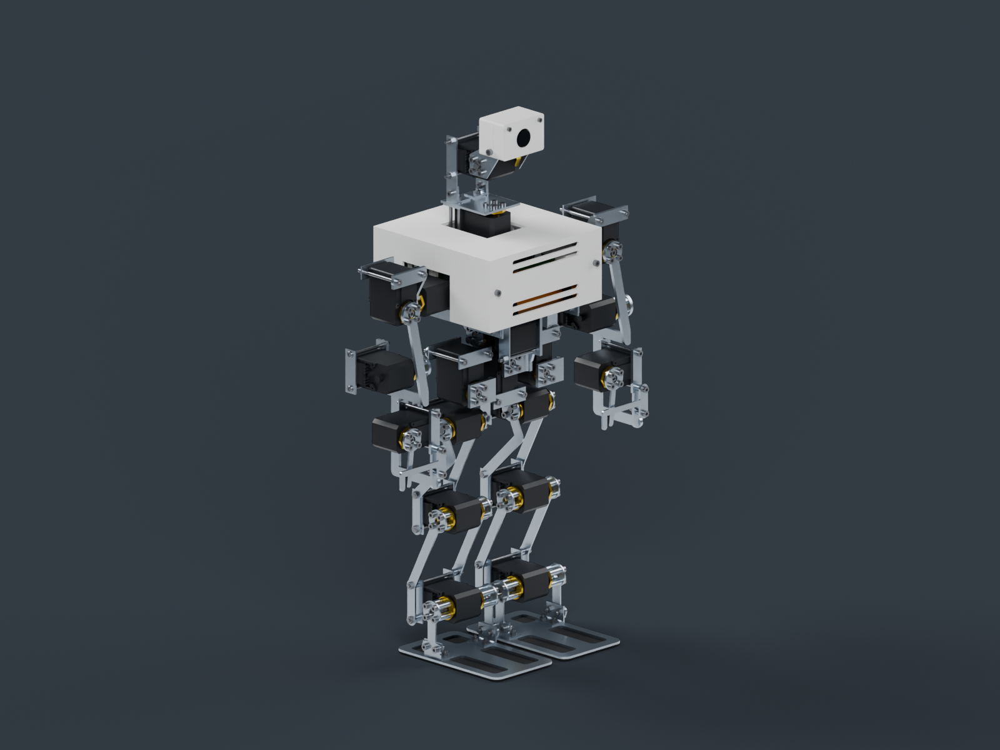
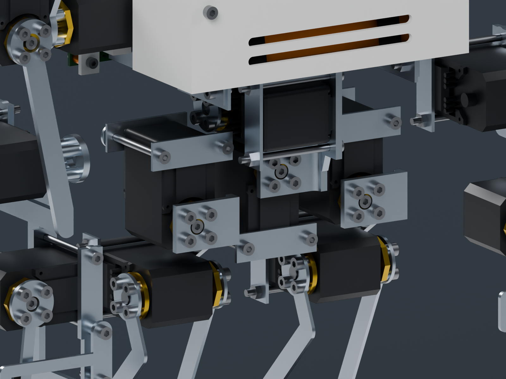
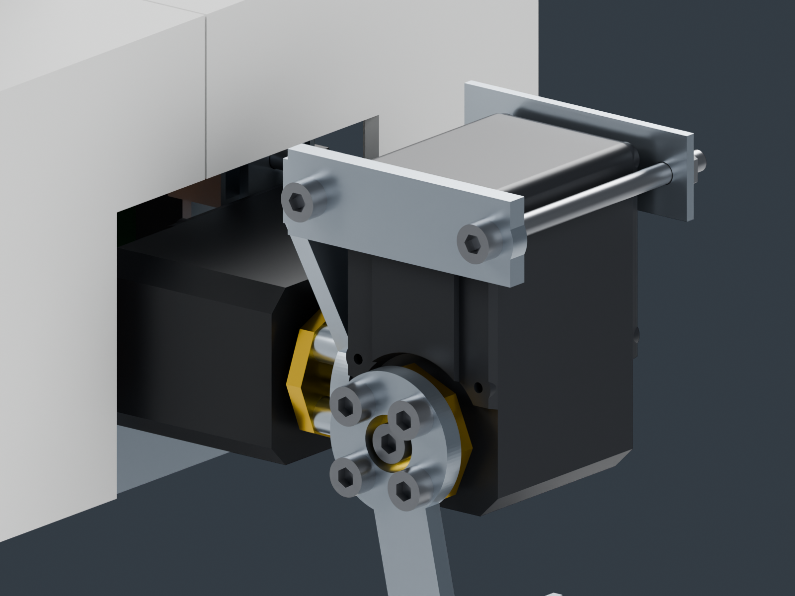
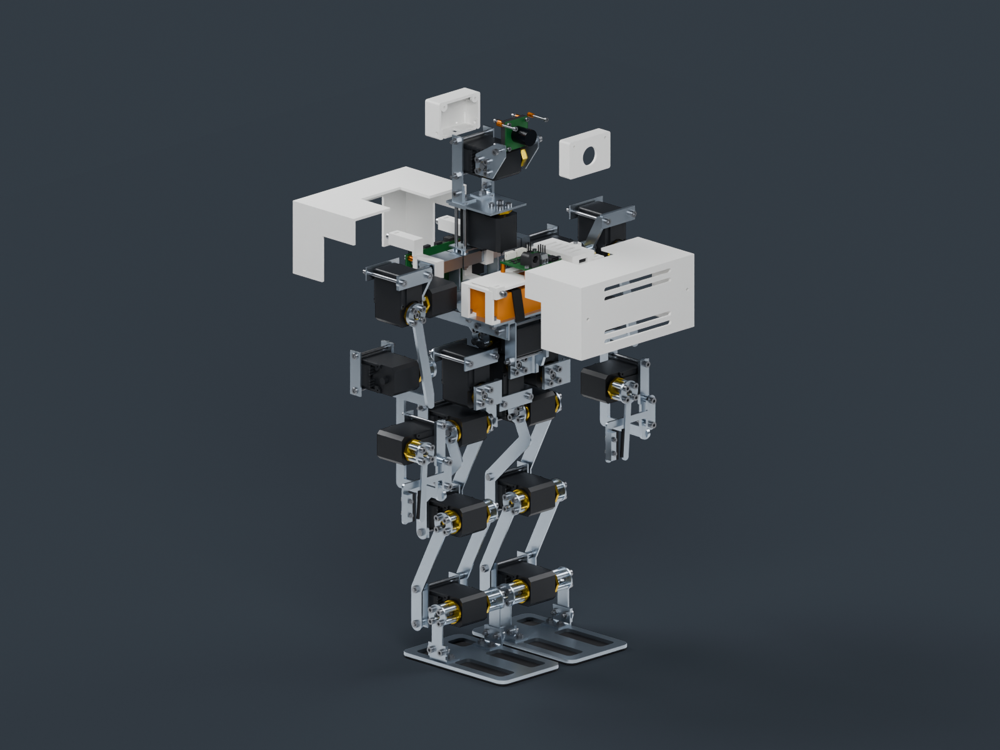
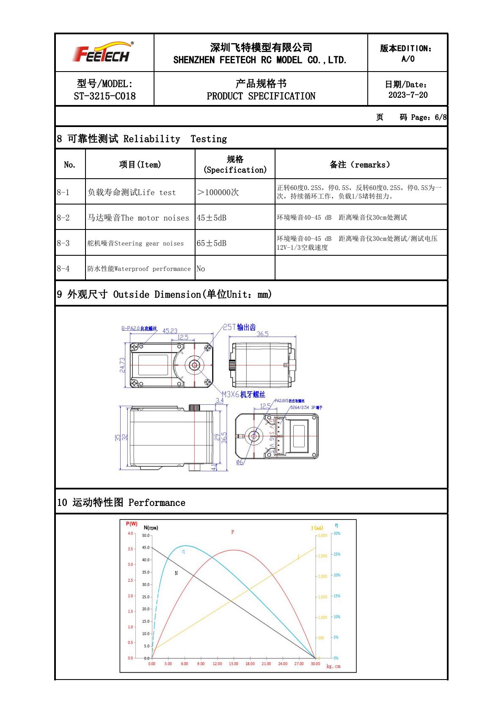
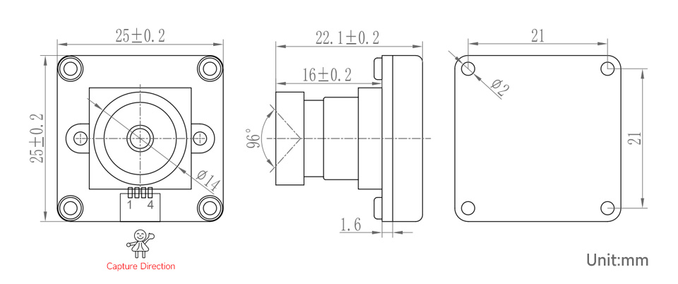

# ATRI-v2 A路线实装审查

20×STS3215-C018 12V，20 DOF，无hip_yaw。骨盆两片大铝夹板已移除，改为开放式局部连接；承力件采用激光板和标准角铝/铝管，PETG为不透明哑光白、2.4mm壁厚。现机22DOF软件没有迁移到这套机构。

**当前不是可直接整机下单的制造放行版。** 几何审查、加工文件和渲染有同源输出，但完整线束、质量与预算仍未闭合。见[打样说明](MANUFACTURING-NOTES.md)和[当前核验](out/ATRI-v2-工程验证.md)。

- 装配快照 `out/assembly-snapshot.json` 当前 **1033** 件，其中仍含待清理的 `battery-secondary*` 三项（清理后约 **1030** 件）。**件数不是放行数字。**
- 已计质量约 **2469 g**（设计目标 2300 g，硬顶 2450 g，**超硬顶**，且未计线束/相机/总线板/降压板/IMU/音频等）；`design_mass_closed: false`、`physical_mass_verified: false`。
- **G0–G4 全部 OPEN**：购物车（G0）、舵机温升（G1）、单腿整机质量（G2）、赛方定义（G3）、无 hip_yaw 转向误差（G4）。逐条要求见 [`out/gates.json`](out/gates.json)。



## 最新髋腰结构



左右前转接件已重画，右件与中框零位间隙为 1.32 mm。髋侧摆与腰侧摆均改为前后双侧支承（后角铝 + 自由后盘 + 轴端保持件）。6 项专项连接测试通过；中央结构 31 个侧摆组合抽样通过。髋俯仰大角度后隔柱干涉、右髋外摆与下垂右臂干涉仍开放。已计质量约 2469 g，超过 2450 g 硬顶，且尚未计齐；详见[集成说明](DUAL-SUPPORT-INTEGRATION.md)。

## 验证范围

髋侧摆与腰侧摆已接入双侧支承，详见[集成说明](DUAL-SUPPORT-INTEGRATION.md)。专项连接检查 5 项通过；腿部及支承开关检查 9 项通过。旧版整机测试数量不作为新版通过证据。最新实体检查见 [双侧支承审查](out/dual-support-audit.json)，仍有右髋外摆与下垂右臂干涉，未放行。





## 当前实装改动

- 校正第三方舵机STEP的原生轴心和输出方向；C018主/后舵盘按厂家图分开建模，4-M3、PCD14。
- 髋侧摆和腰侧摆新增后角铝、自由后盘及轴端保持件，形成前后双侧支承。
- 骨盆开放框架、局部角铝转接、外部壳体夹持；不恢复旧120×160大板和M3×35铜柱布局。
- 肩部外置输出、双侧腿板、足部角铝、独立固定/活动手指。大腿后板连续斜撑避开髋俯仰后壳凸起；足板开窗减重。
- 采用有官方机械图的Pi 4B；**单电池**为实际107×33×22mm、169g的3S2200mAh（Gens Ace GEA223S25T3GT）规格；第二包与扩展托盘已移除，扩容只作受门禁提案见[电源扩展](POWER-EXPANSION.md)；USB相机朝+X，电缆向下预留。
- 电池有托盘和两条绑带，主板有官方孔位载架，总线板使用完整厂家STEP，降压板使用无假孔位的夹持托座。
- VL53L1X作为头部前侧20×24×1.6mm夹扣/胶粘预留包络进入主装配，未虚构厂商孔位。
- 头/胸外壳分件、普通螺母/隔离柱捕获座；14件PETG/TPU提供定向3MF。当前没有热熔螺母。

## 可下载文件

- [完整STEP压缩包](out/packages/ATRI-v2-review.step.gz)（解压后是未简化的装配STEP）
- [完整打样审查包](out/packages/ATRI-v2-manufacturing-review.zip)（DXF、3MF、STL与逐件清单）
- [URDF与完整网格包](out/packages/ATRI-v2-simulation-review.zip)
- [Blender可见装配场景](out/blender/ATRI-v2-assembly-review.blend)
- [文件SHA256](out/packages/checksums.json)

原始STEP超过GitHub单文件限制，因此以无损gzip保存；压缩包经过解压哈希/CRC检查。仿真zip解压到`out/`后得到`sim/meshes`和逐件STL，也可用生成命令复现。此处所有文件均为未放行审查版。

**审查图**：`out/blender/renders/`（`product_iso.png`、`product_front.png`、`product_rear.png`、`detail_pelvis.png`、`detail_horn.png`、`detail_camera.png`、`detail_gripper.png`、`service_exploded.png`）为 GPU 光追 CAD 审查图，非实物照片；`service_exploded.png` 是维护拆解示意，不是逐颗螺母的完整装配工序。`out/render4k/` 的 4K 展示图尚未生成。

**Webots**：`out/sim/atri_v2.urdf` 有 20 个 revolute（m/rad），**尚未真实导入 Webots 运行**。v2 导入冒烟与状态见 `WEBOTS-STATUS.md` / `out/webots/`，当前尚未生成；冻结的 22 DOF 世界仍是 `webots/worlds/atri_22dof.wbt`，不能作为 v2 通过 Webots 任务验证的证据。

## 文件与复现

所有命令在此工作树根目录执行。CadQuery必须使用本仓库`.venv-cad`（Python3.12）。

```bash
PYTHONPATH=design python3 -m unittest software.atri.tests.test_v2_rebuild -q
PYTHONPATH=design .venv-cad/bin/python -m unittest discover -s software/atri/tests -p 'test_v2_*.py' -q
PYTHONPATH=design python3 -m v2.generate
PYTHONPATH=design .venv-cad/bin/python -m v2.cad_audit
blender --background --python design/v2/blender_build.py -- --out design/v2/out --samples 64
```

生成器严格从同一次`cad_export.build_items()`导出；缺件或无效实体会报错，不静默替换、跳过或合并丢件。Blender MCP已用于可见窗口同步；渲染强制Cycles HIP、禁用CPU回退。

| 入口 | 用途 |
|---|---|
| `profile.py` | 机构尺寸、限位、采购件接口与预算参数 |
| `*_cad.py`、`*_mount.py`、`torso_shell.py` | 当前实际结构与安装件 |
| `cad_export.py`、`review_export.py` | 同源STEP/STL/URDF/WebGL输出 |
| `manufacturing.py` | 激光毛坯、角铝参考模板、定向3MF、逐件未决项 |
| `blender_sync.py`、`blender_build.py` | 可见场景同步、HIP光追，禁止替换旧相机模型 |
| `out/manufacturing/manifest.json` | 逐件装配身份、材料、加工文件、未决项 |
| `out/cad/ATRI-v2-review.step` | 完整装配审查STEP |
| `out/preview/ATRI-v2.html` | 自包含WebGL预览 |
| `out/sim/atri_v2.urdf` | 20个revolute；m/rad；尚未真导入Webots |

旧`plates.py`/`layout.py`示意尺寸保留供历史代码引用，**不作为当前打样入口**；旧DXF/SVG已移至`legacy-superseded`。

## 厂家资料与真实性





图纸来自[飞特C018规格书](https://www.feetechrc.com/Data/feetechrc/upload/file/20240507/6385067068652648096680943.pdf)，不是实物装配照片。Pi4孔位以[官方机械图](https://datasheets.raspberrypi.com/rpi4/raspberry-pi-4-mechanical-drawing.pdf)为准；相机为[微雪OV2735 USB A](https://www.waveshare.com/ov2735-2mp-usb-camera-a.htm)，总线板为[Bus Servo Adapter A](https://www.waveshare.com/wiki/Bus_Servo_Adapter_(A))，降压板为[DFR0831](https://wiki.dfrobot.com/dfr0831/)。

第三方Pi4 STL只能提供外观/保守组件包络，不能替代官方孔位尺寸；C018端子与第三方STEP修订差异仍须核对。没有已制造整机，因此不展示或伪造“实机照片”。

质量设计目标2.30kg、硬顶2.45kg；不能只按550/650g铝预算判断整机质量。当前紧固件包络质量偏重，完整整机账未闭合。预算close估算¥3137、retail估算¥3961，均不是已锁购物车；G0要求close≤¥3000且12V SKU截图，当前不通过。hold k=2踝仍超额定，walk k=1.4仅在目标质量假设下通过85%利用率。
