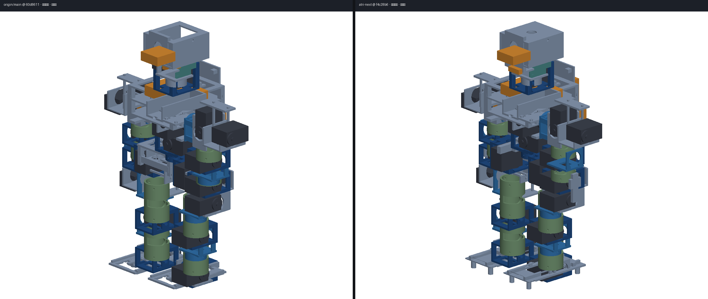
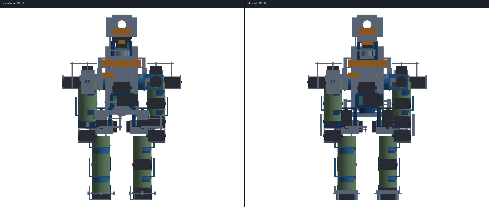
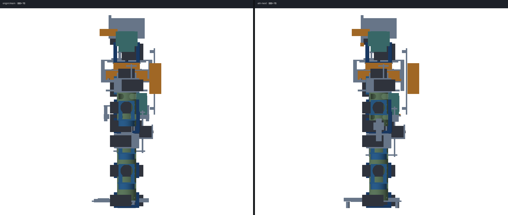

# CAD 现状对照 · 小组讨论稿

> **一句话**：main 是第 5 轮后的可制造骨架；`atri-next` 在其上做了第 6–10 轮布置修补。零位摆放错误已经清掉，但质量、扭矩、铝件孔系这三件事**打印件挖不掉**，所以要讨论要不要冻 v1、另开 v2。  
> **分支**：`origin/main` @ `60d8611`（左） · `atri-next` @ `f4c28b6`（右）  
> **图**：机械零位、同一套画家算法渲染（`design/cad/tools/render_assembly.py`）。不是展示姿态，也不是 WebGL 预览。  
> **本文不是**：开工单、采购单、也不改 `atri-next` 上的零件。现行方案先留着。

对照对象与根 README 一致：本线不合 main，也不从 main 再拉。数字仍分两层——URDF 历史口径 vs CAD 实装。权威过程记录：`design/handoff/装配一致性修正记录.md`、`design/handoff/过期口径修正记录.md`。

---

## 这是什么 / 不是什么

- **是**：给组会用的机械对照。左边 main（第 5 轮后），右边 next（第 10 轮后）。
- **是**：把「看起来像穿模」和「摆放错误」分开：叉锁盘、笼夹持算配合；非相邻零件占同一空间才是要改的穿模。
- **不是**：否定 main 的运动学。22 DOF、STS3215、髋/肩错轴 30–35 mm、赛框 600×300×300 两边共用。
- **不是**：已经决定重构。v1 冻在 `atri-next`，v2 另开分支才能动铝 U / 官方 39.60 包络。

---

## 一眼能看出的差别

左 `origin/main`，右 `atri-next`。都是机械零位。

> 渲染脚本里 `front` 是 −Y 相机（机器人侧面），`side` 是 +X 相机（机器人正面）。下面「正视 / 侧视」按人形习惯，不按脚本文件名。

### 等轴测



单张：[main](cad-compare/main-iso.png) · [next](cad-compare/next-iso.png)

能看出：next 头顶封上、相机圆孔；脚四角垫加高，笼子不再当脚；骨盆从「胯下挡板」改成接到胸框的 U。

### 正视（看胯与脚）



单张：[main](cad-compare/main-side.png) · [next](cad-compare/next-side.png)

能看出：main 胯口空、脚板贴踝轴；next U 臂收到胸框立柱，脚垫落地。髋距仍是 |Y|=45 mm，宽仍 263 mm。

### 侧视（看头与背挂）



单张：[main](cad-compare/main-front.png) · [next](cad-compare/next-front.png)

能看出：main 头壳开天窗、拾音探出前脸；next 拾音进相机罩，背挂模块贴板**外侧**（深从 146 吃到约 159 mm，赛框深 300 仍够）。

色块约定与 CAD 预览相同：灰=结构，深蓝=笼/叉，绿=Φ40 管，黑=舵机占位，橙=电子件。

---

## 数字对照（高 × 宽 × 深）

报名、答辩用 **CAD 实装**。URDF 质量尚未回灌，避免和未定案的整机方案抢跑。

| 维度 | origin/main @ 60d8611 | atri-next @ f4c28b6 | 说明 |
|---|---|---|---|
| **实装包络** | **407 × 263 × 146 mm** | **约 407 × 263 × 159 mm** | 赛框 600×300×300。宽被肩部错轴吃到 263，余量 37 mm。深 +13 mm 是背挂改贴板外，不是整机加长 |
| **结构质量** | **1490 g / 81 件（实算）** | 同量级（门禁 ≤1490 g，只减不增） | PETG 1.27 g/cm³ + 外壁/填充。大件：胸框 ~138 g，笼 ~22 g×13 |
| **整机质量** | **≈3136 g（纸面）** | 同左，**未定案** | 结构 + 舵机 1210 + 电子/电池 316 + 线束紧固 120 |
| **额定扭矩主判据** | **0.98 N·m @12V** | 同左 | 飞特 STS3235 规格书 + DFRobot SER0070。堵转×50%=1.47 只作峰值 |
| **踝 / 腰需求** | 踝 **1.492 N·m（152%）**；`trunk_roll` **1.899 N·m（194%）** | 同左 | 第 6–10 轮几乎没减远端质量，扭矩不会自己好 |
| **错轴** | 髋/肩 roll **35 mm**、pitch **30 mm** | **禁止手写**，只认 `fit_stagger.py` | 8–12 mm 是端面净距，不是错轴 |
| **CAD 舵机占位** | 45.2 × 24.7 × **35.0** mm | 同左 | 官方/实测无耳 **45.40 × 24.80 × 39.60** 未回填 |
| **零位 ❌ 摆放错误** | 第 5 轮后约 **19 对**（髋簇、爪×髋、电子件穿板等） | **`pair_inspect --errors` = 0** | 预览里还能看见叉穿过舵机，那是锁盘配合，不是摆放错误 |
| **门禁** | `pair_inspect` / `sweep_check` | 另加 `test_layout.py` **15 项** | 宽≤270、高≤420、深≤165；垫=全机 zmin；零位爪不穿髋 |
| **T-03 搬运** | 无目标仍可能按任务卡参数去抓 | **无 object 通道失败、不 grasp**；`align` 按 `x_cm` 动肩/肘 | 软件在 `software/atri`，432 项测试 |

功率口径两边相同：额定订正后平均约 18.92 A，30 min 需标称 **11.83 Ah / 电池约 1.19 kg**。现选 3S 2000 mAh 大约 13 min。答辩不要写 30 分钟续航。

---

## `atri-next` 第 6–10 轮改了什么

main 已经做完第 1–5 轮：错轴 30–35、`kind` 落座、干涉分类、官方额定 0.98。下面只列**本线多出来的布置**。全程不切 `pair_inspect` AABB、不改 `kit.IF` / Φ40、不加外壳。

| 轮 | 改什么 | 为什么 | 刻意没动 |
|---|---|---|---|
| **6** | 骨盆改 U（材料走 y=±60 与后桥）；肘叉紧凑无芯棒；夹爪锁舵盘外表面；后跟 48 mm | 静立要像一条底盘；前臂 39.2 mm 塞不下标准叉+夹爪舵机 | 髋距 45、错轴、管径 |
| **7** | U 上段收到 y=±48 接胸框；左右脚 `mirror`；拾音进相机罩 | 预览里盆骨像挡板、两脚不对称、麦克风探出前脸把深顶到 149 | 头 zmax、肩宽 |
| **8** | 夹爪 `orient()` 跟输出轴；垫加到笼半高之下 | 零位右爪穿进 `hip_yaw` 2440 mm³；笼子比垫低，不是步态设计。平移舵机离轴会对不上花键 | `rest_deg`、`clock:flip`（装配记录已证对轴向占据无效） |
| **9** | 背挂贴板外（`BACK_X=60.5`）；髋 yaw 臂法兰贴舵盘；右臂立柱朝内；roll 臂让开 yaw 笼 | 清掉剩下 5 对 ❌ | 肩簇参数、官方 39.60 |
| **10** | 配合/穿模分家；右脚窝翻到 `−X_CTR`；腰/头按真实钟点挖槽；T-03 fail-fast | 舵机 X 不对称，只 mirror Y 会让右踝还在鞋里；预览把锁盘当成穿模 | 铝 U、减重窗、39.60 |

详细条目仍以 `design/handoff/装配一致性修正记录.md` 为准。

---

## 改完之后还痛在哪

第 10 轮解决的是「零位零件自己不要穿模」。下面这些**打印修补解决不了**，或越补越歪。

| 痛点 | 现状 | 为什么挖窗不够 |
|---|---|---|
| **整机太重 / 扭矩超额定** | 结构 1490 g，整机纸面 3.14 kg；踝 152%、腰 194% | 22 只 STS3215 自己就 1210 g。结构再挖 100–150 g，踝大概仍 >130% 额定。路径表 A 挖到 900–1100 g 结构，也到不了 0.98 以内 |
| **脚撑不住** | 4 根 Φ8×13 mm 细柱，横向跨距只有 40 mm，中足踝窝挖穿 | 着地面积约 201 mm²，压强不是问题，侧向像高跷。要条状垫、加轨距，脚质量允许涨到 42 g |
| **关节模块是打印笼，不是铝 U** | `joint_cage` 带 Φ34 芯棒进 Φ40 管 + MF106ZZ | 市售 STS3215 铝 U 是夹机体+让舵盘穿过，**没有**这套 `kit.IF`。STS3215 **没有安装耳**，通用耳孔支架装不上（见 `买代替打-决策表.md`） |
| **19.6 mm 髋/肩簇** | 两只 35 mm 厚舵机靠 30–35 mm 错轴才不咬 | 目录铝 U 塞不进这个间距。簇只能继续 C 臂（以后 6061），或**改 URDF 轴距** |
| **CAD 占位偏瘦** | 轴向 35.0 vs 官方 39.60 | 回填要改 `GAP` / `HORN_FACE`，必须重跑 `fit_stagger.py` / `fit_clocking.py`。现在回填会把第 8–10 轮让位打乱 |
| **电源** | 2000 mAh vs 需求 11.83 Ah | 和骨架重构正交，但定重量方案时必须一起写 |
| **预览仍像穿模** | 叉穿过舵机、笼包着机体 | 配合面。预览里笼/叉已半透明。不要为「好看」切掉锁盘 |

---

## 为什么要考虑重构

现在**没有整机实物**。改运动学和换铝件的成本最低，再拖到打完 81 件 PETG 再迁，转接块和报废件会堆起来。

三条路（组会拍一条）：

| | 做法 | 适合 |
|---|---|---|
| **冻 v1 + 继续挖** | 脚改条垫、胸框/背板/笼开窗，目标结构 1250–1350 g | 这周要看轻一点、站稳一点；铝 U 仍对不上口 |
| **冻 v1 + 零件重做、URDF 不动（建议的 v2）** | 膝/踝/肘：飞特官方 U + 小转接进 Φ40；髋/肩簇：6061 C 臂；胸/盆/头/脚仍打印；官方 39.60 从第一天进 `servo_frame` | 软件、Webots、任务卡继续用；把「撑不住、太重、孔系不对」一次做对 |
| **连运动学重开** | 加大髋/肩轴距，目录 U 直接进簇 | 只有认定 19.6 mm 是死结。URDF、Webots、限位、技能关节名全跟 |

官方路径表原来就写 **A+B**：大件打印减重，22 个关节模块优先金属。第 6–10 轮走的是「先把打印骨架摆对」。要上金属，就不要在 v1 笼子上继续贴。

---

## 重构代价、好处、难度

以「冻 v1、开 `atri-v2`、URDF 轴距先锁死」为默认。

| | 内容 |
|---|---|
| **好处** | 膝踝肘刚度和副轴座按金属件来，脚按着地面积来，舵机包络一次对齐 39.60，少一轮「占位偏了再挖」。结构有机会掉到路径 B 的量级（膝踝肘换铝大约 −100–200 g；簇另做铝臂才接近表上 550–700 g） |
| **直接工时** | 量 1 套官方主 U/侧 U/底 U → 写转接 → 重跑错轴/钟点求解 → 新脚 → 扫掠。大约数天到两周，不是一晚切窗 |
| **采购** | 飞特 WJ-ZJZH-0004/0005/0006 适配最好，1688 常「不单发」要整单；通用耳孔 U **孔系不对**，要台钻/铣或改设计去迁就支架。预算路径 B 写过大约 +300 元、省 20+ 小时打印——前提是孔系对得上 |
| **软件** | 方案「URDF 不动」：任务卡 / FSM / 432 项测试 / Webots 映射可继续用。改轴距才动 URDF |
| **风险** | 买错孔距；簇仍然装不下目录 U；转接打转；官方 39.60 让宽/深再涨一截（门禁宽 270、深 165） |
| **难度（人）** | 拧螺丝不难。难的是 **IF 重映射**：Φ40 芯棒、MF106ZZ、PCD14 端面孔，和商品 U 不是同一个零件 |
| **难度（决策）** | 19.6 mm 锁不锁。锁 = 簇继续 C 臂；放 = 真·从头，仿真链要重接 |

装机本身比打印笼简单：钟点对了就是套上拧 M2.5/M3。钟点不对，铝件不能现场热风改，和现在预览穿模是同一类错，只是材料更硬。

---

## 建议的保留办法（先做、不挡讨论）

现行 `atri-next` **先不动零件**。

```bash
# 在 atri-next 上打冻结标签（示例名，组会可改）
git tag -a v1-print-cad -m "第10轮后打印骨架：零位无摆放错误，重量/铝U未定案"
git push origin v1-print-cad
```

新设计用独立分支（例如 `atri-v2`）。软件目录继续共用。预览、对照、回退随时切 `v1-print-cad`。

---

## 请组会拍板

1. **v1 是否冻结**为对照基线（建议：是）。
2. **下一步**：只改脚+开窗 / URDF 不动的金属关节模块 / 连 19.6 mm 一起放开。
3. **铝件**：先买 1 套飞特官方 U 对 `servo_frame` 卡尺，还是先改设计迁就通用耳孔支架。
4. **电源**：骨架方案和 11.83 Ah 缺口是否同一份纪要里写死。

未拍板前：不改 `kit.IF`、不手写 stagger、不回填 39.60、不加外壳、不在 `atri-next` 上覆盖 v1。
